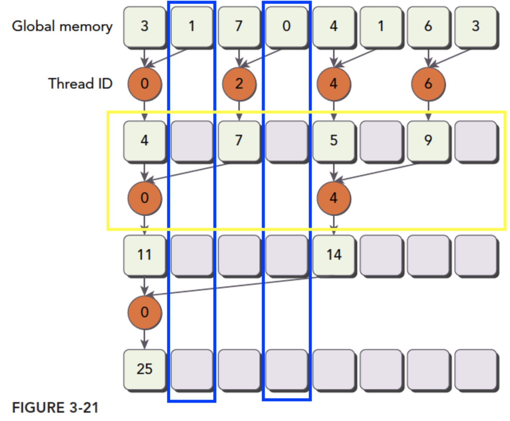
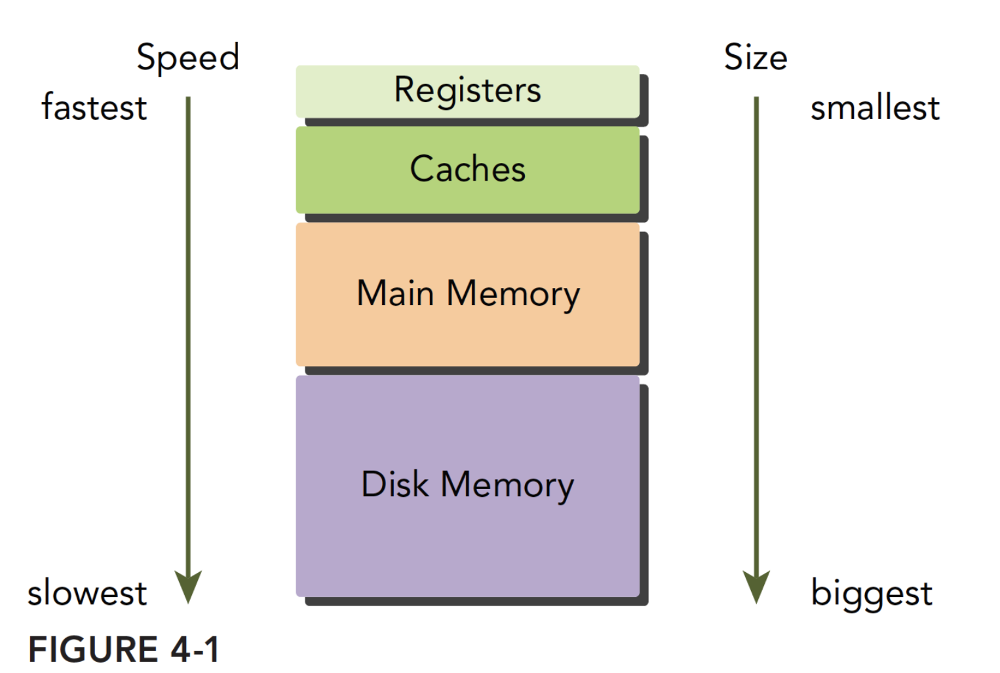
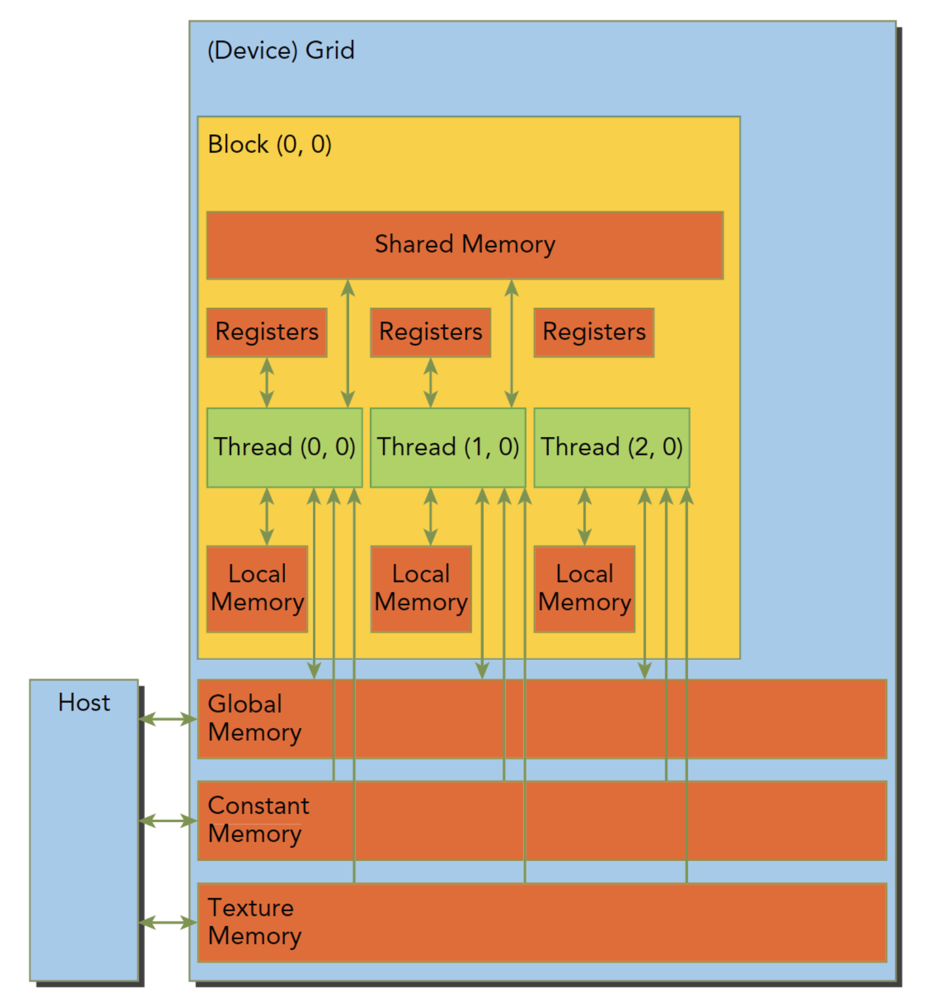

# Cuda教程
基于[参考教程](https://www.bilibili.com/video/BV1sM4y1x7of/?spm_id_from=333.337.search-card.all.click&vd_source=e494a00b2ff9e62e2e79d78af8084068)以及[博客](https://face2ai.com/program-blog/#GPU)进行cuda学习

[TOC]

# GPU简介
GPU比较擅长数值计算，比较核心的性能指标：
* 核心数
* 显存容量
* 计算峰值
* 显存带宽

## GPU与CPU的异构数据处理：


CPU中很多晶体管用于控制和缓存，而GPU使用了大量的算术逻辑单元。CPU和GPU都有动态随机存取储存器，使用PCIe总线连接莱完成调度。
## Cuda
在Cuda中CPU成为Host，GPU成为Device。通过CPU调动GPU进行计算。Cuda提供两种API来驱动GPU，运行时API在高级汇编语言层面，驱动API在汇编语言层面，两种实现性能几乎无差异。此外还可以使用Cuda库中封装的功能来调用GPU。


# nvidia-smi
可以通过这个命令来查看：


# Cuda程序
## hello world
实现一个简单的hello world程序：
```c
#include<stdio.h>

__global__ void hello_world(void)
{
    printf("Hello world\n");
}

int main(int argc, char **argv)
{
    printf("CPU hello world\n");
    hello_world<<<1, 10>>>();
    cudaDeviceReset();
    return 0;
}
```
上面代码中`__global__`代表这是一个可以在device上运行的函数，`<<<1, 10>>>`是对调用GPU进行配置。`cudaDiviceReset()`包含隐式同步，在GPU函数调用之后就会回到CPU线程而不会等待函数执行完毕，所以需要这行等待device执行完毕。

一般Cuda程序分为：
* 分配GPU内存
* 拷贝内存到设备
* 调用内核函数执行计算
* 把计算就够拷贝回主机端
* 内内存销毁

## 编程模型
在Cuda中存在两个环境，CPU和GPU。它们通过总线连接：
* 主机：CPU及其内存
* 设备：GPU及其内存

两个设备的内存、软件硬件都是完全隔离的。下面要研究的层次：
* 内存
* 线程
* 核函数
    * 启动核函数
    * 编写核函数
    * 验证核函数
* 错误处理

### 内存管理
首先是通过总线复制内存：
```c
cudaError_t cudaMemcpy(void * dst,const void * src,size_t count,
  cudaMemcpyKind kind)
```

其中`kind`可以有四种模式：
* cudaMemcpyHostToHost
* cudaMemcpyHostToDevice
* cudaMemcpyDeviceToHost
* cudaMemcpyDeviceToDevice

代表四个复制内存的方式，如果成功则返回`cudaSuccess`否则返回`cudaErrorMemoryAllocation`。可以使用指令打印详细错误信息：
```c
char* cudaGetErrorString(cudaError_t error)
```
GPU的内存层次：


后面会详细介绍Block内共享内存和Grid内全局内存。还有分配函数：
```c
cudaError_t cudaMalloc(void** devPtr, size_t size)
```
给出指针的地址并为其分配内存。`cudaMemset`为一块内存赋值，`cudaFree`释放内存。

### 线程管理
在内核函数执行的时候只能有一个grid，一个grid可以有很多块，每个块可以有很多线程。


一个线程块block中的线程可以完成下述写作：
* 同步
* 共享内存

为了正确执行分配每个线程中的数据，需要获得线程的编号：
* `uint3 blockIdx`，拥有xyz三个无符号整型
* `uint3 threatIdx`，拥有xyz三个无符号整型

同样也通过两个数据保存边界：
* `dim3 gridDim`，有xyz三个无符号整型
* `dim3 blockDim`，有xyz三个无符号整型

其中`dim3`是手动定义的，`uint3`是在设备端执行的时候可见的，不可以在运行时修改。

### 核函数
核函数是用NVCC编译成在GPU上跑的机器码的代码。首先是通过CPU启动核函数
#### 启动核函数
启动核函数使用cuda c指令：
```c
kernel_name<<<grid, block>>>(argument list)
```
其中grid和block就是上面定义的`dim3`类型。在调用的时候也可以用int直接调用。对于每个线程都有`threadIdx`和`blockIdx`唯一的确定一个线程。一个函数被启动之后控制权会立刻回到CPU，为了防止这样可以用命令等待设备执行完毕：
```c
cudaError_t cudaDeviceSynchronize(void);
```
同时也有隐性方法来等待设备执行完，比如使用拷贝，这样就必须等待设备执行完毕：
```c
cudaError_t cudaMemcpy(void* dst, const void* src,
    size_t count, cudaMemcpyKind kind);
```

#### 编写核函数
核函数的声明：
```c
__global__ void kernel_name(argument list);
```
cuda c中有三个c中没有的限定符：
* `__global__`，可以从主机调用也可以从计算能力3以上的设备调用，在设备端执行。必须返回void
* `__device__`，在设备端调用执行
* `__host__`，在主机端调用执行，可以省略限定符

有些函数可以同时使用`__device__`和`__host__`，这样编译时就会生成两份机器码。

#### 验证核函数
可以在每编写一段代码就进行验证正确性，与写其他代码一样，可以增加效率。可以在调试的时候把核函数设置为单线程。

### 错误处理
每一个cuda API都会返回一个错误类型，这对开发阶段检查错误很有用。可以使用`CHECK(cuda_fun())`来打印错误信息。

### 核函数计时
运行时间是判断性能优化的指标。可以直接用cpu中的计时器计算：
```c
start = cpuSecond();
//执行代码
t = cpuSecond() - start;
```
但是CPU调用GPU的时候也有一定时间，这时需要使用`nvprof`命令在终端测试，这个命令会给出核函数的执行时间，更加准确。在进行性能优化的时候也要考虑硬件的理论极限。

### 组织并行进程
除了在一个块中安排多个线程也可以使用二维的块和线程，对应的就不能使用单纯的线程索引：
* $ix = threadIdx.x + blockIdx.x\times blockDim.x$
* $iy = threadIdx.y + blockIdx.y\times blockDim.y$

同时通过在数组中的坐标和线程的绝对坐标访问数组中的值：
$$
i = ix + iy \times nx
$$
不同的线程组织方式有不同的性能，也是优化方式之一。

# cuda执行模型
GPU架构：


GPU是围绕一个流式多处理器(SM)的扩容阵列搭建的，通过这种复制实现硬件的并行。图中包括的关键组件：
* CUDA核心
* 共享内存/一级内存
* 寄存器文件
* 加载/储存单元
* 特殊功能单元
* 线程束调度器

## SM
GPU中每个SM可以支持数百个线程并行，每个GPU通常有多个SM。当一个核函数的网格被启动的时候，多个block会被同时分配给可用的SM上执行。当一个block分配给一个SM的时候就不能分配给另一个SM了。

## 线程束
Cuda使用单指令多线程管理执行线程，不同设备有不同的线程束大小但基本为32 。也就是说不管block和block中的线程有多少对机器来说某一时间只有32个线程在SM上运行。

## SIMD/SIMT
单指令多数据通常用于向量机，也就是有多个数据但是执行只有一个命令，这样的结构就比较死板。相对来说单指令多线程允许每个线程有分支执行。SIMT有的关键特性：
* 每个线程都有自己的指令地址计数器
* 每个线程都有自己的寄存器状态
* 每个线程可以有一个独立的执行路径

通过给每个线程唯一的标号来保证上述性质，并保证了各个线程的独立。

## Cuda编程的组件与逻辑


上图是cuda中线程与硬件的关系。

### Fermi架构


Fermi架构是第一个完整的GPU架构。逻辑图如上：
* 512个加速核心，cuda核
* 每个cuda核心都有一个全流水线的整数算数逻辑单元ALU，和一个浮点数运算单元FPU。
* cuda核被组织到16个SM上
* 6个384-bit的GDDR5的内存接口
* 支持6G的全局机栽内存
* GigaThread引擎，分配线程块到SM线程束调度器上
* 768kb二级缓存，被所有SM共享

SM包含以下资源：
* 执行单元（cuda核）
* 调度线程束的调度器和调度单元
* 共享内存，寄存器文件和一级缓存

每个SM有16个加载储存单元，所以每个时钟周期内有16个线程计算源地址和目的地址。特殊功能单元SFU执行固有指令，比如正弦，余弦，平方根和插值，每个时钟周期在每个线程上执行一个固有指令。

SM有两个线程束独傲赌气和两个指令调度单元，当一个线程块被指定给一个SM的是哦呼里面的所有线程被分为线程束，每次选择两个线程束执行指令。线程束在SM上交替执行。同一个块上的线程束切换是没有消耗的


### Kepler架构
Kepler架构有强化的SM，动态并行，Hyper-Q等技术突破。Kepler可以内核启动内核，这样可以用GPU实现简单递归。Hyper-Q技术是CPU与GPU的同步硬件连接，可以实现多个队列。

## 理解线程束执行
在硬件层面是不会以多维的形式执行命令的，还是以一维的方式处理。所以三维的线程块和线程是一个逻辑概念，方便编程。运行时一个块被安排在一个SM上，其中的线程按照xyz的顺序排列，按32个线程组成线程束执行单指令多线程。每个线程执行同一个命令，但是有私有的储存。

### 线程束分化
CPU使用流水线作业，执行完一个分支语句之后再向下执行，并且有分支预测机制，所以比较擅长复杂的逻辑运算。但是对于GPU的并行化不能说同一个指令周期执行不同的指令。比如对分支语句：
```c
if(con){
    statement1
}else{
    statement2
}
```
首先对所有线程执行`statement1`，跳过那些不符合分支的线程，之后再执行`statement2`，同样跳过不进入分支的线程。这样的线程束分化会造成严重的性能下降。

一个优化方案就是把同样分支的线程安排在同一个线程束中，这样线程利用率就很高。比如：
```c
__global__ void mathKernel1(float *c)
{
    int tid = blockIdx.x * blockDim.x + threadIdx.x;
    float a = 0.0;
    float b = 0.0;
    if(tid % 2 == 0)
    {
        a = 100.0f;
    }
    else
    {
        b = 200.0f;
    }

    c[tid] = a + b;
}
```
这样组织线程每个线程束里都有一半一半的分支。但是如果把相同分支的线程束组织在一起，比如有64个线程：

```c
__global__ void mathKernel1(float *c)
{
    int tid = blockIdx.x * blockDim.x + threadIdx.x;
    float a = 0.0;
    float b = 0.0;
    if(tid / warpSize == 0)
    {
        a = 100.0f;
    }
    else
    {
        b = 200.0f;
    }

    c[tid] = a + b;
}
```
这样线程束执行就很高效了。实际编译中编译器也会对一些分支代码进行优化，看后面这个教程会不会讲。

### 计算资源
在SM上每个线程有寄存器和SM的共享内存，这些资源的分配影响到了SM上活跃线程的数量。太少可能会造成资源浪费，太多可能会导致储存溢出到全局储存上更浪费时间。

一个线程块被分配了寄存器和共享内存就处于活跃状态，包含的线程束成为活跃线程束，分三类；
* 选定的线程束
* 阻塞的线程束
* 复合条件的线程束

当Sm要执行某个线程束的时候，执行的线程束就叫选定的线程束。准备要执行的线程束叫符合条件的线程束。如果不符合条件就叫阻塞的线程束。要满足以下条件：
* 32个cuda核心可以用于执行
* 执行所需要的资源全部就位

不同的架构同时执行的线程束和活跃的线程束数量是不同的。由于已经被分配了寄存器所以线程束的上下文切换消耗很小。

### 隐藏延迟
对于每个线程有算数延迟（10-20时钟周期）和内存延迟（400-800时钟周期）。在延迟期间需要执行其他活跃线程来保证运算单元和内存带宽被占用满。这样就可以尽可能降低隐藏延迟。如何在延迟期间组织线程束一般是编译器的工作，写代码时主要要合理地选择线程束数量

### 同步
可以通过`__syncthread()`来同步一个块中的线程，所有线程都执行到这个语句的时候才会继续执行。

## 避免分支分化
### 并行规约问题
当计算满足结合性和交换性的时候可以用并行归约的方法处理。利用递归的思想把向量数据分块，分别执行加法计算之后再加到一起，达到用并行计算本来需要靠变量锁等方式一个个计算的问题。在CPU中可以使用分支循环实现，但在GPU中可以优化：

## 避免分支分化
### 并行规约问题
当计算满足结合性和交换性的时候可以用并行归约的方法处理。利用递归的思想把向量数据分块，分别执行加法计算之后再加到一起，达到用并行计算本来需要靠变量锁等方式一个个计算的问题。在CPU中可以使用分支循环实现，但在GPU中可以优化。

```Rust
__global__ void reduceNeighbored(int * g_idata,int * g_odata,unsigned int n)
{
	//set thread ID
	unsigned int tid = threadIdx.x;
	//boundary check
	if (tid >= n) return;
	//convert global data pointer to the
	int *idata = g_idata + blockIdx.x*blockDim.x;
	//in-place reduction in global memory
	for (int stride = 1; stride < blockDim.x; stride *= 2)
	{
		if ((tid % (2 * stride)) == 0)
		{
			idata[tid] += idata[tid + stride];
		}
		//synchronize within block
		__syncthreads();
	}
	//write result for this block to global mem
	if (tid == 0)
		g_odata[blockIdx.x] = idata[0];

}
```
这是一个没有经过优化的代码，通过在每一个块内用并行规约来计算加法。可以见示意图：



可见每次执行中线程束都有大量线程空置。可以通过之前介绍的思想把一直运行的线程控制在一个线程束上来保证高占有率：

```c
__global__ void reduceNeighboredLess(int * g_idata,int *g_odata,unsigned int n)
{
	unsigned int tid = threadIdx.x;
	unsigned idx = blockIdx.x*blockDim.x + threadIdx.x;
	// convert global data pointer to the local point of this block
	int *idata = g_idata + blockIdx.x*blockDim.x;
	if (idx > n)
		return;
	//in-place reduction in global memory
	for (int stride = 1; stride < blockDim.x; stride *= 2)
	{
		//convert tid into local array index
		int index = 2 * stride *tid;
		if (index < blockDim.x)
		{
			idata[index] += idata[index + stride];
		}
		__syncthreads();
	}
	//write result for this block to global men
	if (tid == 0)
		g_odata[blockIdx.x] = idata[0];
}
```
这样每次分支都有大部分线程在跑。

## 循环展开
当在CPU上写代码的时候展开循环没什么用因为编译器会优化，但是写cuda代码时会有比较大的提升。教程中在规约前先展开了循环，把2/4/8个块的数据加到一个块中，实验中能测试到明显的性能优化
```c
__global__ void reduceUnroll2(int * g_idata,int * g_odata,unsigned int n)
{
	//set thread ID
	unsigned int tid = threadIdx.x;
	unsigned int idx = blockDim.x*blockIdx.x*2+threadIdx.x;
	//boundary check
	if (tid >= n) return;
	//convert global data pointer to the
	int *idata = g_idata + blockIdx.x*blockDim.x*2;
	if(idx+blockDim.x<n)
	{
		g_idata[idx]+=g_idata[idx+blockDim.x];

	}
	__syncthreads();
	//in-place reduction in global memory
	for (int stride = blockDim.x/2; stride>0 ; stride >>=1)
	{
		if (tid <stride)
		{
			idata[tid] += idata[tid + stride];
		}
		//synchronize within block
		__syncthreads();
	}
	//write result for this block to global mem
	if (tid == 0)
		g_odata[blockIdx.x] = idata[0];

}
```
就是`if`中的那段，4/8也是在`if`中再加几行。在程序最后，当归约到64个数值的时候后面每次进行规约都会多浪费一半的线程。所以也可以展开：
```c
if(tid<32)
	{
		volatile int *vmem = idata;
		vmem[tid]+=vmem[tid+32];
		vmem[tid]+=vmem[tid+16];
		vmem[tid]+=vmem[tid+8];
		vmem[tid]+=vmem[tid+4];
		vmem[tid]+=vmem[tid+2];
		vmem[tid]+=vmem[tid+1];

	}
```
这样就让每个线程都展开了（~~这里有点小小疑惑，如果说上面的展开优化实际上是省略了块内同步，让不同的线程可以先充分的占用计算资源，那最后只剩一个线程束的情况下这么做真的有用吗？~~）

这种计算不会造成线程之间数据的冲突因为每次同一个线程束执行的时候都先把数据传到寄存器之后行动，所以不会产生读写冲突。`volatile int`类型变量要把变量写会内存，这样每个操作时间之后都会储存数据，不会造成不同步。

最后还可以把后面的所有的`for`循环里的语句全部展开：
```c
	if(blockDim.x>=1024 && tid <512)
		idata[tid]+=idata[tid+512];
	__syncthreads();
	if(blockDim.x>=512 && tid <256)
		idata[tid]+=idata[tid+256];
	__syncthreads();
	if(blockDim.x>=256 && tid <128)
		idata[tid]+=idata[tid+128];
	__syncthreads();
	if(blockDim.x>=128 && tid <64)
		idata[tid]+=idata[tid+64];
	__syncthreads();
```
**小结一下：** 这里主要是减少线程同步的使用，只要有线程同步就可能造成可以填充到cuda核心里的线程束变少，利用率减少。最开始那段可以不用同步是因为每个线程计算的数据块确定下来了，最后可以不同步是因为所有线程在一个线程束里。至于中间部分就是展开for循环会带来多少性能优化，在博客里这部分性能优化是比较少的。所以我暂时认为主要性能优化的点是减少线程同步(增加活跃线程束)和增加线程内的任务(线程束实际上减少)之间的trade off。

**更新：** 我测试了还是使用`for`循环在最后32个线程（一个线程束）上，性能并没有什么差距（与其它两个偶尔高偶尔低）

## 动态并行
动态并行类似递归调用函数，特别的是它的线程同步问题。对于一个父块以及它调用的子块，它的所有子块是隐性同步的，也就是子块全部跑完才会回到父块。

# 全局内存

## 内存模型概述
内存储存存在两种局域性：
* **时间局域行：** 一块内存被访问后一段时间内可能还被访问。
* **空间局域性：** 一块内存附近的内存也可能被访问

基于这样的特性现代内存发展为层次的结构：



CPU和GPU的主存都采用DRAM动态随机存取储存器。而低延迟的比如一级缓存就需要SRAM动态随机存取储存器。当数据被频繁使用的时候就会存向更高一级储存。
## cuda内存模型
对于cuda的内存可以分为两大类：可编程内存和不可编程内存。可编程内存的行为可以通过程序操纵而不可编程内存的行为在出厂的时候就已经确定了。cuda的内存层级有：
* 寄存器
* 共享内存
* 本地内存
* 常量内存
* 纹理内存
* 全局内存

各种内存的可见行可以见：



### 寄存器
寄存器是访问最快的数据，在CPU中寄存器数据在使用时才从下一级储存拷贝，而GPU每个线程所拥有的寄存器是不变的，寄存器变量的生命周期与核函数生命周期一致。每个线程寄存器的数量有上限，一个SM上寄存器数量也有上限，多的变量会储存在内存里很影响效率。所以要尽量避免寄存器溢出：

```c
__global__ void
__launch_bounds__(maxThreadperBlock, minBlocksperMultiprocessor)
kernel(...){
    //code
}
```
其中两个参数分别为每个块最大线程和每个SM最小常驻内存块。也可以在编译时加入：
```c
-maxrregcount=32
```
来限制每个线程分配的寄存器数量。

### 本地内存
对于线程的私有变量：
* 使用未知索引引用的本地数组
* 可能会占用大量寄存器空间的较大本地数组或者结构体
* 任何不满足核函数寄存器限定条件的变量。

本地内存实际上也与全局内存储存在同一区域，访问满延迟高。

### 共享内存
使用修饰符`__shared__`修饰。共享内存也是片上内存，存取比较快。共享内存生命周期与线程块一致。声明共享内存的时候不能太多，SM上内存有限太多会导致同时启动的线程块少。SM的一级缓存和共享内存共享一个片上内存，可以通过函数静态设置内存划分：
```c
cudaError_t cudaFuncSetCacheConfig(const void *func, enum cudaFuncCache);
```
### 常量内存
常量内存用`__constant__`声明，主机端代码可以初始化常量内存。使用函数：
```c
cudaError_t cudaMemcpyToSymbol(const T &symbol, const void *src, size_t count);
```
对于所有设备只可以声明64k的常量内存。如果一个线程束内的所有线程都从一个地址读取数据的话常量内存表现会比较好，因为它的机制是一次读取会广播给线程束内的所有线程。

### 纹理内存
一块只读内存。纹理内存可以在读取的同时进行浮点插入，所以一些滤波程序可以用硬件操作替代程序操作。

### 全局内存
用`__device__`声明，与应用程序生命周期相同。由于全局内存是对其访问，只能以一定数量的字节同时读取，就会可能造成无关数据被读取，吞吐量下降。
### GPU缓存
GPU缓存分为：
* 一级缓存，一个SM一个
* 二级缓存，所有SM共享
* 只读常量缓存和只读纹理缓存

这些缓存都是不可编辑的，只能规定在读操作的时候是使用同时一级二级缓存还是只使用二级缓存。
### 静态全局内存
可以静态分配内存：
```c
...
__device__ float devData;
...
float value = 3.14;
cudaMemcpyToSymbol(devData, &value, sizeof(float));
```
可以通过方法获得设备变量地址：
```c
float *dprt = NULL;
cudaGetSymbolAddress((void**) &dptr, devData);
```

## 内存管理
详细介绍分配传输等内存管理
### 固定内存
因为GPU从自己的内存中读取数据是很快的，远超CPU的读取速度和从CPU中以总线连接的读取速度，所以要尽量避免运行时从主机获得数据。因为在主机中分配内存是分页的，并且操作系统可能随时在储存中切换页，所以cuda在传输过程中需要提前锁定页之后传输，因为页切换对设备来说是不可理解的。在实际操作中可以在主机中分配固定内存：
```c
cudaError_t cudaMallocHost(void ** devPtr, size_t count)
cudaError_t cudaFreeHost(void * ptr)
```
来分配释放内存。固定内存分配释放时间会比较长但是传输时间短，如果传输大规模数据的时候可以考虑使用固定内存。

### 零拷贝内存
可以声明主机和设备都可以访问的内存：
```c
cudaError_t cudaHostAlloc(void ** pHost, size_t count, unsigned int flags)
```
flags的取值：
* `cudaHostAllocDefalt`：分配分页内存。
* `cudaHostAllocPortable`：可移植内存，可以在cuda上下文访问
* `cudaHostAllocWriteCombbined`：在某些设备上可以提高主机到设备传输速度
* `cudaHostAllocMapped`：零拷贝内存

为了能使设备访问零拷贝内存需要：
```c
cudaError_t cudaHostGetDevicePointer(void ** pDevice, void * pHost, unsigned flags)
```
这个flags必须取0 。零拷贝内存读写很慢，尤其是频繁读写就不如使用全局内存。

### 统一虚拟寻址
cuda2.0后把CPU、GPU内存放到同一块虚拟内存上访问，如果是零拷贝内存就可以直接通过指针访问而不需要上面的拷贝。

### 统一内存寻址
在统一内存中创建一个托管内存池，其中的内存可以由一个统一指针访问。使用`__managed__`静态创建或者：
```c
cudaError_t cudaMallocManaged(void ** devPtr, size_t size, unsigned int flags=0)
```
来分配托管内存池变量。

## 内存访问模式
每次内存访问都是以线程束的形式进行。每次读取都是32/128的粒度进行读取，所以说一个线程束的内存读取满足连续性的话就不需要多次请求内存事务。这种优化叫做合并。另外如果某次内存事务读取的第一个地址是32的倍数的话也会增加访问速度，叫对齐。

### 只读缓存
可以设定从全局内存中加载数据为只读缓存，它的粒度为32对读取分散数据比较实用。可以声明：
```c
out[idx] = __ldg(&in[idx]);
//使用关键字限制指针
__global__ void kernel(const int * const __restrict__ input, ...)
```

### 全局内存写入
写入不过一级缓存，粒度是32，每次内存事务分为一段两端四段。其余与读取类似。

### 结构体数组和数组结构体
因为访问数组结构体的时候访问数组数据是连续的，所以最好使用数组结构体。

### 展开读写
可以通过前面的展开技术来增加并行性。

## 核函数带宽
一级缓存的作用除了从全局内存读取数据外，也不会立即覆盖没有使用的数据。在下一次读取的时候如果在一级缓存中命中就不需要重新读取全局内存。于是优化的时候可以通过交叉读取增加读取吞吐量，同时控制在一级缓存不会覆盖的情况下，反而会增加运行速度，因为读取吞吐量增加了。

同时DRAM的储存是分区的，每256字节一个分区，每次只允许一个访问。如果高频地访问同一个区可能会导致拥挤。所以要通过打乱线程块顺序来避免。

