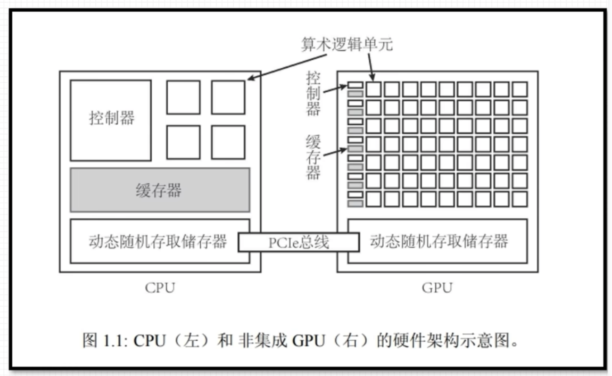
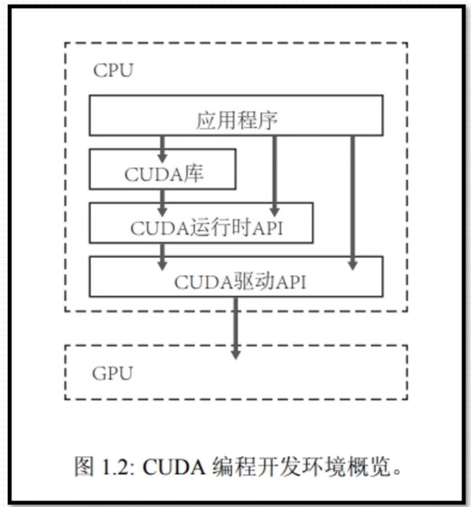
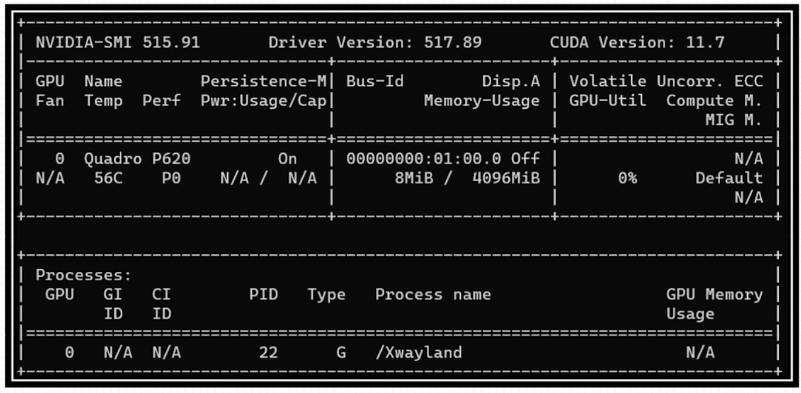
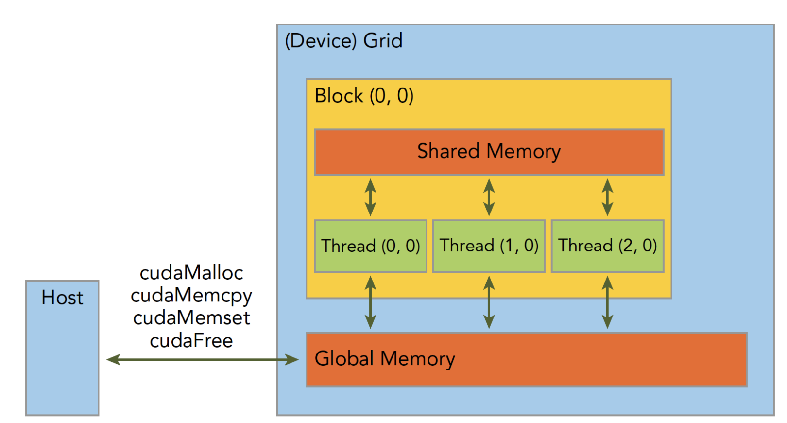
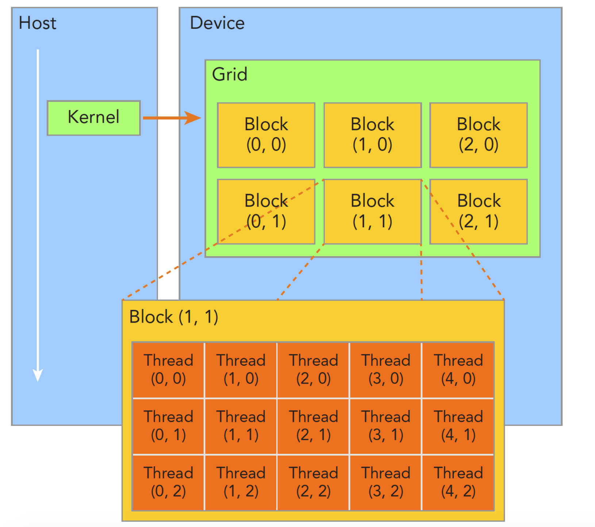
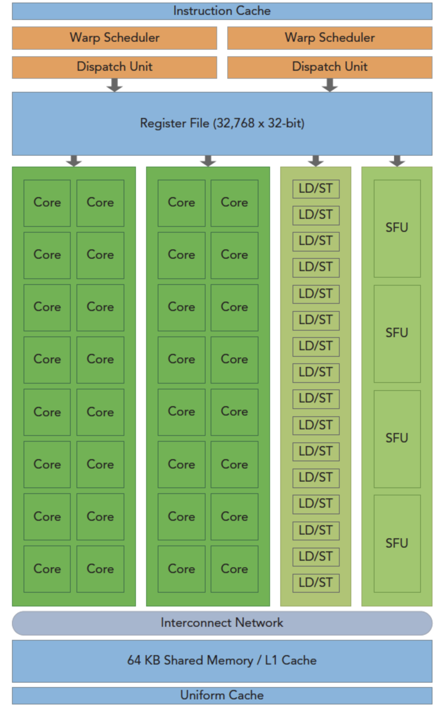
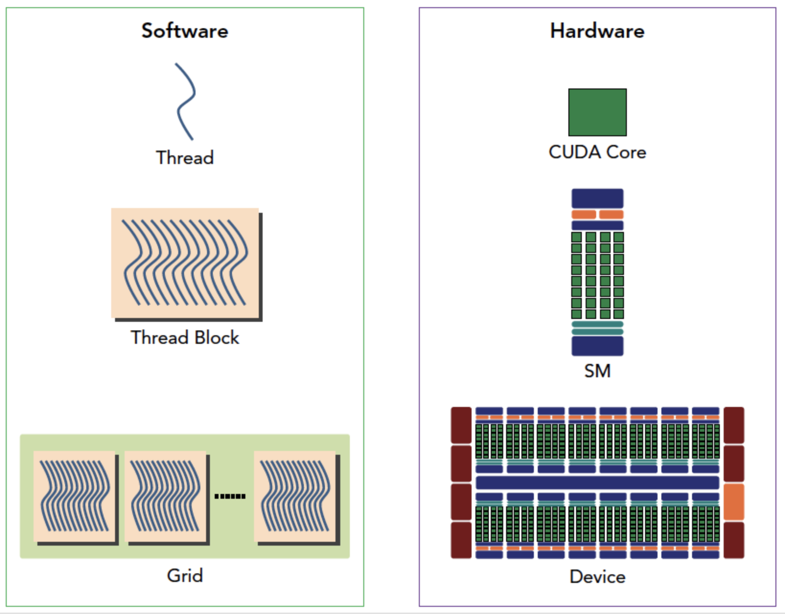
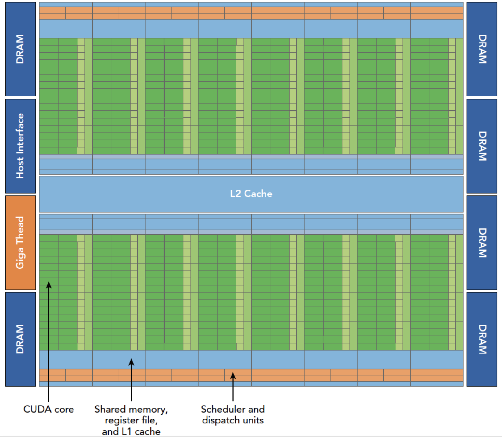
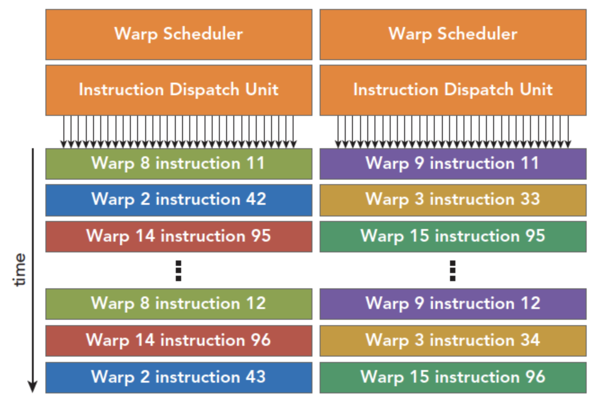

# Cuda教程
基于[参考教程](https://www.bilibili.com/video/BV1sM4y1x7of/?spm_id_from=333.337.search-card.all.click&vd_source=e494a00b2ff9e62e2e79d78af8084068)进行cuda学习

[TOC]

# GPU简介
GPU比较擅长数值计算，比较核心的性能指标：
* 核心数
* 显存容量
* 计算峰值
* 显存带宽

## GPU与CPU的异构数据处理：



CPU中很多晶体管用于控制和缓存，而GPU使用了大量的算术逻辑单元。CPU和GPU都有动态随机存取储存器，使用PCIe总线连接莱完成调度。
## Cuda
在Cuda中CPU成为Host，GPU成为Device。通过CPU调动GPU进行计算。Cuda提供两种API来驱动GPU，运行时API在高级汇编语言层面，驱动API在汇编语言层面，两种实现性能几乎无差异。此外还可以使用Cuda库中封装的功能来调用GPU。



# nvidia-smi
可以通过这个命令来查看：



# Cuda程序
## hello world
实现一个简单的hello world程序：
```c
#include<stdio.h>

__global__ void hello_world(void)
{
    printf("Hello world\n");
}

int main(int argc, char **argv)
{
    printf("CPU hello world\n");
    hello_world<<<1, 10>>>();
    cudaDeviceReset();
    return 0;
}
```
上面代码中`__global__`代表这是一个可以在device上运行的函数，`<<<1, 10>>>`是对调用GPU进行配置。`cudaDiviceReset()`包含隐式同步，在GPU函数调用之后就会回到CPU线程而不会等待函数执行完毕，所以需要这行等待device执行完毕。

一般Cuda程序分为：
* 分配GPU内存
* 拷贝内存到设备
* 调用内核函数执行计算
* 把计算就够拷贝回主机端
* 内内存销毁

## 编程模型
在Cuda中存在两个环境，CPU和GPU。它们通过总线连接：
* 主机：CPU及其内存
* 设备：GPU及其内存

两个设备的内存、软件硬件都是完全隔离的。下面要研究的层次：
* 内存
* 线程
* 核函数
    * 启动核函数
    * 编写核函数
    * 验证核函数
* 错误处理

### 内存管理
首先是通过总线复制内存：
```c
cudaError_t cudaMemcpy(void * dst,const void * src,size_t count,
  cudaMemcpyKind kind)
```

其中`kind`可以有四种模式：
* cudaMemcpyHostToHost
* cudaMemcpyHostToDevice
* cudaMemcpyDeviceToHost
* cudaMemcpyDeviceToDevice

代表四个复制内存的方式，如果成功则返回`cudaSuccess`否则返回`cudaErrorMemoryAllocation`。可以使用指令打印详细错误信息：
```c
char* cudaGetErrorString(cudaError_t error)
```
GPU的内存层次：



后面会详细介绍Block内共享内存和Grid内全局内存。还有分配函数：
```c
cudaError_t cudaMalloc(void** devPtr, size_t size)
```
给出指针的地址并为其分配内存。`cudaMemset`为一块内存赋值，`cudaFree`释放内存。

### 线程管理
在内核函数执行的时候只能有一个grid，一个grid可以有很多块，每个块可以有很多线程。



一个线程块block中的线程可以完成下述写作：
* 同步
* 共享内存

为了正确执行分配每个线程中的数据，需要获得线程的编号：
* `uint3 blockIdx`，拥有xyz三个无符号整型
* `uint3 threatIdx`，拥有xyz三个无符号整型

同样也通过两个数据保存边界：
* `dim3 gridDim`，有xyz三个无符号整型
* `dim3 blockDim`，有xyz三个无符号整型

其中`dim3`是手动定义的，`uint3`是在设备端执行的时候可见的，不可以在运行时修改。

### 核函数
核函数是用NVCC编译成在GPU上跑的机器码的代码。首先是通过CPU启动核函数
#### 启动核函数
启动核函数使用cuda c指令：
```c
kernel_name<<<grid, block>>>(argument list)
```
其中grid和block就是上面定义的`dim3`类型。在调用的时候也可以用int直接调用。对于每个线程都有`threadIdx`和`blockIdx`唯一的确定一个线程。一个函数被启动之后控制权会立刻回到CPU，为了防止这样可以用命令等待设备执行完毕：
```c
cudaError_t cudaDeviceSynchronize(void);
```
同时也有隐性方法来等待设备执行完，比如使用拷贝，这样就必须等待设备执行完毕：
```c
cudaError_t cudaMemcpy(void* dst, const void* src,
    size_t count, cudaMemcpyKind kind);
```

#### 编写核函数
核函数的声明：
```c
__global__ void kernel_name(argument list);
```
cuda c中有三个c中没有的限定符：
* `__global__`，可以从主机调用也可以从计算能力3以上的设备调用，在设备端执行。必须返回void
* `__device__`，在设备端调用执行
* `__host__`，在主机端调用执行，可以省略限定符

有些函数可以同时使用`__device__`和`__host__`，这样编译时就会生成两份机器码。

#### 验证核函数
可以在每编写一段代码就进行验证正确性，与写其他代码一样，可以增加效率。可以在调试的时候把核函数设置为单线程。

### 错误处理
每一个cuda API都会返回一个错误类型，这对开发阶段检查错误很有用。可以使用`CHECK(cuda_fun())`来打印错误信息。

### 核函数计时
运行时间是判断性能优化的指标。可以直接用cpu中的计时器计算：
```c
start = cpuSecond();
//执行代码
t = cpuSecond() - start;
```
但是CPU调用GPU的时候也有一定时间，这时需要使用`nvprof`命令在终端测试，这个命令会给出核函数的执行时间，更加准确。在进行性能优化的时候也要考虑硬件的理论极限。

### 组织并行进程
除了在一个块中安排多个线程也可以使用二维的块和线程，对应的就不能使用单纯的线程索引：
* $ix = threadIdx.x + blockIdx.x\times blockDim.x$
* $iy = threadIdx.y + blockIdx.y\times blockDim.y$

同时通过在数组中的坐标和线程的绝对坐标访问数组中的值：
$$
i = ix + iy \times nx
$$
不同的线程组织方式有不同的性能，也是优化方式之一。

# cuda执行模型
GPU架构：



GPU是围绕一个流式多处理器(SM)的扩容阵列搭建的，通过这种复制实现硬件的并行。图中包括的关键组件：
* CUDA核心
* 共享内存/一级内存
* 寄存器文件
* 加载/储存单元
* 特殊功能单元
* 线程束调度器

## SM
GPU中每个SM可以支持数百个线程并行，每个GPU通常有多个SM。当一个核函数的网格被启动的时候，多个block会被同时分配给可用的SM上执行。当一个block分配给一个SM的时候就不能分配给另一个SM了。

## 线程束
Cuda使用单指令多线程管理执行线程，不同设备有不同的线程束大小但基本为32 。也就是说不管block和block中的线程有多少对机器来说某一时间只有32个线程在SM上运行。

## SIMD/SIMT
单指令多数据通常用于向量机，也就是有多个数据但是执行只有一个命令，这样的结构就比较死板。相对来说单指令多线程允许每个线程有分支执行。SIMT有的关键特性：
* 每个线程都有自己的指令地址计数器
* 每个线程都有自己的寄存器状态
* 每个线程可以有一个独立的执行路径

通过给每个线程唯一的标号来保证上述性质，并保证了各个线程的独立。

## Cuda编程的组件与逻辑


上图是cuda中线程与硬件的关系。

### Fermi架构


Fermi架构是第一个完整的GPU架构。逻辑图如上：
* 512个加速核心，cuda核
* 每个cuda核心都有一个全流水线的整数算数逻辑单元ALU，和一个浮点数运算单元FPU。
* cuda核被组织到16个SM上
* 6个384-bit的GDDR5的内存接口
* 支持6G的全局机栽内存
* GigaThread引擎，分配线程块到SM线程束调度器上
* 768kb二级缓存，被所有SM共享

SM包含以下资源：
* 执行单元（cuda核）
* 调度线程束的调度器和调度单元
* 共享内存，寄存器文件和一级缓存

每个SM有16个加载储存单元，所以每个时钟周期内有16个线程计算源地址和目的地址。特殊功能单元SFU执行固有指令，比如正弦，余弦，平方根和插值，每个时钟周期在每个线程上执行一个固有指令。

SM有两个线程束独傲赌气和两个指令调度单元，当一个线程块被指定给一个SM的是哦呼里面的所有线程被分为线程束，每次选择两个线程束执行指令。线程束在SM上交替执行。同一个块上的线程束切换是没有消耗的



### Kepler架构
Kepler架构有强化的SM，动态并行，Hyper-Q等技术突破。Kepler可以内核启动内核，这样可以用GPU实现简单递归。Hyper-Q技术是CPU与GPU的同步硬件连接，可以实现多个队列。

## 理解线程束执行

