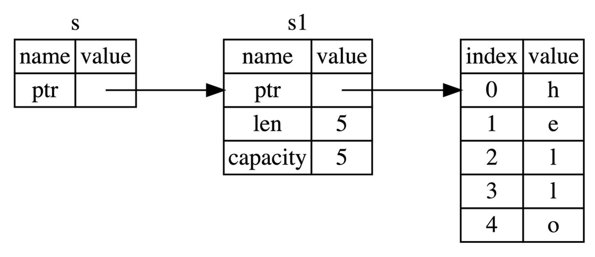

# Rust入门
[TOC]
本文档基于Rust语言圣经学习Rust语言。
# Cargo入门
## 创建项目
Rust使用cargo管理项目，在创建项目时使用：
```
cargo new FILENAME
cd FILENAME
```
cargo会生成项目目录和文件。编译运行时：
```
cargo run
```
`cargo run`包含了编译运行的步骤，如果只编译可以使用`cargo build`。另外这两个命令都是debug模式，为了在开发阶段快速编译，所以运行慢。如果要提高性能运行：
```
cargo run --release
cargo build --release
```
## cargo check
`cargo check`可以快速检查代码是否能编译通过，在大型项目中很好用。
## cargo.toml和cargo.lock
* cargo.toml是项目数据描述文件，储存了所有元配置信息。
* cargo.lock是项目依赖清单，一般根据cargo.toml生成，不需要修改。

#### package配置
package中记录了项目描述信息：
```
[package]
name = "world_hello"
version = "0.1.0"
edition = "2021"
```
`name`是项目名称，`version`是项目版本，`edition`是项目大版本。
#### 项目依赖
在`cargo.toml`中有三种方式定义依赖：
* 基于Rust官方仓库`create.io`，通过项目版本引入。
* 基于项目源代码的git url
* 本地项目的路径
```
[dependencies]
rand = "0.3"
hammer = { version = "0.5.0"}
color = { git = "https://github.com/bjz/color-rs" }
geometry = { path = "crates/geometry" }
```
# Rust基础入门
## 变量
Rust需要手动声明变量可变，这为变量提供了安全性和灵活性。
#### 变量绑定
Rust的变量绑定语句为：`let a = "abc"`。Rust语言遵循所有权原则，每一个内存都有一个变量作为主人。

#### 变量可变性
变量声明前面加`mut`关键字可以声明可变变量。
#### 使用下划线忽略未使用变量
在Rust中创建但不使用变量会被警告，可以使使用下划线来让Rust忽略不使用的变量。使用下划线开头的变量即使在后面使用也不会报错。

```rust
fn main() {
    let _x = 5;
    let y = 10;		\\警告
	println!("{}", _x);	\\不会报错
}
```
#### 变量解构
`let`可以从较复杂的数据中解构出匹配的部分：
```rust
fn main() {
    let (a, mut b): (bool,bool) = (true, false);
    // a = true,不可变; b = false，可变
    println!("a = {:?}, b = {:?}", a, b);

    b = true;
    assert_eq!(a, b);
}
```
###### 解构式赋值
在Rust1.59版本后可以在左式中使用切片，元组和结构体：
```Rust
struct Struct {
    e: i32
}

fn main() {
    let (a, b, c, d, e);

    (a, b) = (1, 2);
    // _ 代表匹配一个值，但是我们不关心具体的值是什么，因此没有使用一个变量名而是使用了 _
    [c, .., d, _] = [1, 2, 3, 4, 5];
    Struct { e, .. } = Struct { e: 5 };

    assert_eq!([1, 2, 1, 4, 5], [a, b, c, d, e]);
}
```
!小问题：在结构体中定义但没有使用的变量也会警告，即使它只是作为右值传递。

```Rust
fn main() {
    let a = Struct { e: 1, f: 2 };
    println!("{}", a.e);

	Struct {e, ..} = Struct{e: 1, f: 2}	#都会警告
}
```
#### 变量和常量的差异
常量在编译完成就只有固定值，所以不能用`mut`关键字。常量使用`const`关键字声明：

```Rust
const LIGHT_SPEED = 299792458
```
#### 变量遮蔽（shadowing）
Rust允许声明相同的变量名，后面的会遮蔽前面的：

```Rust
fn main() {
    let x = 5;
	# 在main函数的作用域内对之前的x进行遮蔽
    let x = x + 1;

    {
	# 在当前的花括号作用域内，对之前的x进行遮蔽
        let x = x * 2;
        println!("The value of x in the inner scope is: {}", x);
    }

    println!("The value of x is: {}", x);
}
```
运行后输出12和6.

Tips：变量遮蔽不会释放前一个变量的内存，而是在生命周期结束后被释放。所以一般可以在另一个作用域内使用来遮蔽掉作用域外的变量。

## 基本类型
Rust类型氛围基本类型和复合类型，复合类型一般来说无法解构。基本类型包括：

* 数值类型，包括有符号整数（`i8, i16, i32, i64, isize`），无符号整数（`u8, u16, u32, u64, usize`），浮点数（`f32, f64`）以及有理数、复数。
* 字符串型，包括字符串字面量和字符串切片（`&str`）
* 布尔型，包括 `true, false`
* 字符类型，包括单个unicode字符。大小为4字节。
* 单元类型，即`()`。唯一的值也是`()`。


### 类型推导与标注
Rust是静态语言，需要在编译阶段知道数据类型。但是Rust可以通过上下文推导数据类型，有时Rust也无法推导出类型时会报错：

```Rust
let guess = "42".parse().expect("not a number!");	#报错

let guess:i32 = "42".parse().expect("not a number!");
let guess = "42".parse()::<i32>.expect("not a number!");	#可以
```
### 数值类型
#### 整数类型
对于指定长度的整型，它的取值范围为$2^{n-1}$ ~ $2^{n-1}-1$，对于无符号是$0$ ~ $2^n -1$。isize与usize与CPU架构有关，如果CPU为32/64位即为32/64bit。
##### 整型溢出
整型溢出在编译时会崩溃，但在`--release`下会按补码循环溢出求值。但这种行为仍然应该认为是错误代码。

我们可以使用标准库中的方法处理溢出：
* `wrapping_add`按补码循环处理。
* `checked_add`溢出时返回None。
* `overflowing_add`溢出时返回补码循环值和一个是否溢出的布尔值
* `saturating_add`限定不能超过该类型最大值和最小值。

Tips: None是Option枚举的值，表示可能不存在意义的值。而()通常表示函数没有返回值，虽然意义相似但是场景不同：
```Rust
enum Option<T> {
    Some(T),
    None,
}

fn example_function() -> () {
    // 函数体
}
```
#### 浮点数
浮点数分为`f32` 和 `f64`。因为现在计算机处理两种类型的数据速度相当来，所以默认使用`f64`。

##### 浮点数陷阱
浮点数由于实现与整型不同，需要在使用时小心：

* **浮点数往往是想要数值的近似表达**：浮点数由于使用二进制精度，而我们通常使用十进制表达浮点数。比如`0.1`就不会得到精确数值。
* **浮点数在某些特性上是反直觉的**：浮点数并没有实现等于的接口，所以在某些使用上要小心。
* 要避免对浮点数使用相等判断，结果在数学上未定义时要小心。

如果一定要取等，可以选择设定最小值：

```Rust
(0.1_f64 + 0.2 - 0.3).abs() < 0.00001
```
##### NaN
数学上未定义的操作会返回NaN（not a number）。所有与NaN进行操作都会返回NaN，并且NaN不能比较。如果想要确定是否是NaN可以使用`is_nan()`方法。
#### 数字运算
Rust支持所有加减乘除模运算。
```Rust
fn main() {
  // 编译器会进行自动推导，给予twenty i32的类型
  let twenty = 20;
  // 类型标注
  let twenty_one: i32 = 21;
  // 通过类型后缀的方式进行类型标注：22是i32类型
  let twenty_two = 22i32;

  // 只有同样类型，才能运算
  let addition = twenty + twenty_one + twenty_two;
  println!("{} + {} + {} = {}", twenty, twenty_one, twenty_two, addition);

  // 对于较长的数字，可以用_进行分割，提升可读性
  let one_million: i64 = 1_000_000;
  println!("{}", one_million.pow(2));

  // 定义一个f32数组，其中42.0会自动被推导为f32类型
  let forty_twos = [
    42.0,
    42f32,
    42.0_f32,
  ];

  // 打印数组中第一个值，并控制小数位为2位
  println!("{:.2}", forty_twos[0]);
}
```
#### 位运算
Rust的位运算有：`&`按位与`|`按位或`^`按位异或`！`按位非`<<`左移填充零`>>`右移填充0，负数填充1。
#### 序列（Range）
Rust可以简洁地实现连续序列：
```Rust
for i in 1..=5 {
    println!("{}",i);
}
```
默认不包含右界，需要包含时使用`=`。Range只能用于整型和字符型。

#### 使用As类型转换
Rust使用As进行类型转换
```Rust
let a:i32 = 10;
let b:f32 = a as f32;
```

#### 有理数和复数
可以使用num库实现复数，在`cargo.toml`中添加`num = "0.4.0"`。
```Rust
use num::complex::Complex;

 fn main() {
   let a = Complex { re: 2.1, im: -1.2 };
   let b = Complex::new(11.1, 22.2);
   let result = a + b;

   println!("{} + {}i", result.re, result.im)
 }
```

### 字符、布尔、单元类型
#### 字符
Rust中字符可以使用unicode，大小为4字节。
#### bool
布尔只有`true`和`false`值，大小为1字节。
#### 单元类型
用于表示没有返回值，或者用()当作键值对中的map值来表达不关系map只关心key。单元类型不占用任何内存。

### 语句与表达式
在Rust中语句没有返回值，表达式有返回值，需要区分。
#### 语句
`let`是一个语句，没有返回值。所以不能把它赋给其他值。

Tips：我目前的版本let编译与语言圣经给出的不同：
```Terminal
error: expected expression, found `let` statement
 --> src/main.rs:3:10
  |
3 | let b = (let a = 8);
  |          ^^^
  |
  = note: only supported directly in conditions of `if` and `while` expressions

error: could not compile `playground` (bin "playground") due to 1 previous error
```

经搜索let可以与`if`、`while`结合，这是Rust中文手册给出的例子：
```Rust

let dish = ("Ham", "Eggs");

// 此主体代码将被跳过，因为该模式被反驳
if let ("Bacon", b) = dish {
    println!("Bacon is served with {}", b);
} else {
    // 这个块将被执行。
    println!("No bacon will be served");
}
```
使用时可以通过匹配来判断等式两边是否可以匹配并选择执行块。但这里仍然还是认为`let`只是与`if`、`while`配合使用而不是作为语句返回值。虽然在vscode中尝试把语句赋值给变量会认定变量为布尔值。
#### 表达式
表达式可以求值并返回一个值。在语句中`let a = 6`中的6也是一个表达式并返回值`6`。只要是可以返回值的都是表达式。

```Rust
fn main() {
    let y = {
        let x = 3;
        x + 1
    };

    println!("The value of y is: {}", y);
}
```
这里面`let y`语句后面的花括号也是表达式。表达式后面不能带分号，否则就会变成语句。也可以使用if语句来选择块表达式：
```Rust
let z = if x % 2 == 1 { "odd" } else { "even" };
```
Tips：赋值表达式会返回`()`。我在运行`println!`的时候还遇到了这样的问题：
```Rust
println!("a is {:?}", a = a+1); //输出11，不会改变外部的a
println!("a is {:?}", a += 1);  //输出()，且会改变外部a

```
这部分应该涉及到借用，上面的打印借用了a，下面的表达式只是把`a+=1`的返回值发给了输出函数。

### 函数
一个加法函数：
```Rust
fn add(i: i32, j: i32) -> i32 {
   i + j
 }
```
#### 函数要点
* 使用蛇形命名
* Rust不关心声明位置
* 参数要声明类型

#### Rust返回值
Rust通过`->`指定返回类型。因为函数也是表达式，可以在函数块结尾加上表达式来作为返回值。也可以直接使用return提前返回值。
```Rust
fn plus_or_minus(x:i32) -> i32 {
    if x > 5 {
        return x - 5
    }

    x + 5
}

fn main() {
    let x = plus_or_minus(5);

    println!("The value of x is: {}", x);
}
```
return表达式也不带分号
##### 特殊的返回值
无返回值，可以显式或隐式地说明，使用`-> ()`或者不再块最后加上表达式。
##### 发散函数
有些函数永远不返回，使用`-> !`来声明。这种返回类型经常用作会导致程序崩溃的函数。

Tips：代码圣经中习题的例子，`unimplemented!()`表示某个功能没有实现并且立即崩溃。`panic!()`用于导致恐慌，运行到这里也会直接崩溃。`todo!()`也代表未实现功能并且计划实现。

## 所有权和借用
### 所有权
目前的三种内存管理机制：
* 垃圾回收机制（GC）比如Java，Go
* 手动内存分配，比如C++
* 所有权管理内存，在编译是根据一系列规则检查。

所有权管理只在编译期进行，所以不会在运行时检查，安全又高效。
#### 一段不安全的代码
```c++
int* foo() {
    int a;          // 变量a的作用域开始
    a = 100;
    char *c = "xyz";   // 变量c的作用域开始
    return &a;
}                   // 变量a和c的作用域结束

```
这段代码由于a的内存被释放，返回的a值会报错。*c则会一直在内存上知道程序结束。这些都是内存不安全行为。
#### 栈(Stack)与堆(Heap)
了解堆栈概念对理解如何优化Rust代码性能十分重要。
##### 栈
栈按照后进先出的方式组织值，增加数据叫进栈，移出数据叫出栈。栈中数据必须占据已知的固定空间大小。
##### 堆
如果要储存大小未知或可变化的数据就要在堆中。当放入数据的时候堆找到一个足够大小的位置储存数据并在栈中储存一个指针指向数据。指针大小是固定的，所以可以在栈中通过指针访问变量。
##### 性能区别
在栈上分配内存会比在堆上更快，调用栈只需要把数据放入栈顶，调用堆需要函数调用或者更复杂的系统调用。
##### 所有权和堆栈
当调用函数的时候需要把变量依次压入栈中，在调用结束后依次销毁。在堆中的数据由于缺乏组织性需要跟踪并释放这些变量，这是Rust所有权的目的。
#### 所有权原则
Rust所有权的规则：
* 每一个值为一个变量所拥有，这个变量称为值的所有者。
* 每一个值只能有一个所有者。
* 当所有者离开作用域的时候值会被丢弃。

##### 变量作用域
作用域是一个变量创建到作用域结束（比如花括号）的一段时间内变量有效。
#### 变量绑定背后的数据交互
对于储存在栈上的简单数据：

```Rust
let x = 5;
let y = x;
```
这个过程并未发生所有权转移而是通过在栈中拷贝x的值给y。但对于储存在堆上的：
```Rust
let s1 = String::from("hello");
let s2 = s1;
```
对于String，在栈上的数据由堆指针，字符串长度和字符串容量组成。在上面代码中不会直接拷贝。我们这时有两种选择：
* 在堆上拷贝String值，这是很耗费性能的。
* 在栈上复制String指针，但是会导致一个数据有两个所有者。

如果一个数据有两个所有者，在释放的时候可能会同时释放一块内存两次。所以Rust选择**在s1赋值给s2的时候直接移交所有权给s2，在s1作用域结束的时候不会释放任何值。**
##### 克隆（深拷贝）
Rust永远不会自动创建深拷贝。可以使用`clone()`来克隆堆上的数据：
```Rust
let s1 = String::from("hello");
let s2 = s1.clone();
```
##### 克隆（浅拷贝）
浅拷贝只发生在栈上，Rust中对栈上储存的数据会自动拷贝而不会有所有权转移。Rust中有`Copy`特征的类型可以拷贝，包括：
* 所有整数类型
* 所有布尔类型
* 所有浮点数类型
* 所有字符串类型
* 所有元组类型，需要元组内包含的类型也可以copy
* 不可变引用`&T`

#### 函数传值与返回
在有`Copy`特性的类型那里调用函数会复制值而没有所有权移动。在没有`Copy`的类型那里则会产生所有权移动，在函数后面传入的变量将失效。对于返回值也一样：
```Rust
fn main() {
    let s = String::from("hello");  // s 进入作用域

    takes_ownership(s);             // s 的值移动到函数里 ...
                                    // ... 所以到这里不再有效

    let x = 5;                      // x 进入作用域

    makes_copy(x);                  // x 应该移动函数里，
                                    // 但 i32 是 Copy 的，所以在后面可继续使用 x

} // 这里, x 先移出了作用域，然后是 s。但因为 s 的值已被移走，
  // 所以不会有特殊操作

fn takes_ownership(some_string: String) -> String{ // some_string 进入作用域
    println!("{}", some_string);
    some_string //所有权移动到返回值那里。
} // 这里，some_string 移出作用域并调用 `drop` 方法。占用的内存被释放

fn makes_copy(some_integer: i32) { // some_integer 进入作用域
    println!("{}", some_integer);
} // 这里，some_integer 移出作用域。不会有特殊操作
```
Tips：
##### String变量的可变形
对于String变量声明的时候是可变的，但如果转换所有权之后要重新声明可变性：
```Rust

fn main() {
    let mut s = String::from("hello, ");
    
    //报错
    let s1 = s;

    s1.push_str("world")
}
```
##### 部分move
在解构赋值的时候允许部分move，即一部分被引用一部分被移动所有权：
```Rust
struct Person {
    name: String,
    age: Box<u8>,
}

    ... 

let Person { name, ref age } = person;
//报错
println!("The person struct is {:?}", person);
```
因为此时name的所有权已经被转移，所以会报错。但是通过ref关键字可以声明引用，所以调用`person.age`是不会报错的。
### 引用与借用
Rust通过借用（borrowing）概念来在不转移所有权的情况下引用其他变量。在使用完毕后把借用交回。
#### 引用与解引用
常规的引用是一个指针，指向变量的地址。在使用值的时候解引用。
```Rust
fn main() {
    let x = 5;
    let y = &x;

    assert_eq!(5, x);
    assert_eq!(5, *y);
}
```
#### 不可变引用
在函数中通过`&`传递引用：
```Rust
fn main() {
    let s1 = String::from("hello");

    let len = calculate_length(&s1);

}

fn calculate_length(s: &String) -> usize {
    s.len()
}
```
这样就不需要复杂的所有权操作来把所有权从函数传回。



引用是默认不可变的。Tips：引用整型时是引用地址所以需要解引用，但是对String来说引用是对堆数据的所有权管理所以可以直接访问。
#### 可变引用
声明可变引用可以使用`&mut`声明。
##### 可变引用同时只能存在一个
为了避免数据竞争Rust不允许同时生成两个可变引用。数据竞争会发生在：
* 两个或更多指针访问一个数据。
* 至少有一个指针用来写入数据。
* 没有同步数据机制。

数据竞争可能会导致运行时未定义行为，所以Rust在编译时就不允许数据竞争出现。
##### 可变引用和不可变引用不可以同时存在
Rust不允许在不可变引用的同时存在可变引用。在旧版编译器中引用的作用域是花括号中所以规定比较严格，在新编译器中会在最后一次使用的时候结束引用。所以可以编译：
```Rust
fn main() {
   let mut s = String::from("hello");

    let r1 = &s;
    let r2 = &s;
    println!("{} and {}", r1, r2);
    // 新编译器中，r1,r2作用域在这里结束

    let r3 = &mut s;
    println!("{}", r3);
}
```

这种编译器行为被Rust称为Non-Lexical Lifetimes(NLL)。
#### 悬垂引用（Dangling References）
悬垂引用指指针指向的内容被释放了但是指针仍然存在。Rust不允许引用是悬垂状态，如果仍然存在引用就无法释放内存。
## 复合类型
复合类型是不同类型基本变量组合，比如结构和枚举。可以通过复合类型更高度的抽象代码。
### 字符串与切片
#### 切片（slice）
对字符串的切片就是对其一部分的引用：
```Rust
let s = String::from("hello world");

let hello = &s[0..5];
let world = &s[6..11];
```

切片数据结构会保存String引用，切片的开始位置和长度。切片的标识符是`&str`。切片也是不可变引用所以同样不可以与可变引用同时出现。在编辑器的函数说明中可以看到函数变量类型。

字符串字面量也是切片。
#### 什么是字符串
Rust使用unicode编码字符串，常说的字符串就是Rust标准库中的`String`和切片`&str`。
#### String 和&str的转换
从,`String`到`&str`可以通过直接取引用，从`&str`到`String`可以通过
```Rust
//&str to string
String::from("hello,world");
"hello,world".to_string();

//string to &str
let s = String::from("hello,world!");
say_hello(&s);
say_hello(&s[..]);
say_hello(s.as_str());
```

#### 字符串索引
Rust不能通过索引来访问字符串：
```Rust
let s1 = String::from("hello");
let h = s1[0];
```
##### 深入字符串
字符串是使用UTF-8编码的，所以有些时候索引没有任何意义：
```Rust
let hello = String::from("hello");   //5字节
let people = String::from("中国人") //实际上是9字节，取索引没有意义。
```
Rust为字符串提供了不同的表现形式，之所以不去用索引是因为变长的字符索引仍然需要遍历字符串取寻找合法字符，这不一定十分高效。（相比不变长度索引的O(1)）

#### 字符串切片
字符串切片无法保证索引在字符间隙上。所以要小心使用以免报错：
```Rust
let hello = "中国人";

let s = &hello[0..2];
```
#### 操作字符串
##### push
可以通过push在字符串结尾增加字符，只要字符串可变：
```Rust
fn main() {
    let mut s = String::from("Hello ");

    s.push_str("rust");
}
```
##### insert
通过`insert`来插入字符：
```Rust
fn main() {
    let mut s = String::from("Hello rust!");
    s.insert(5, ',');
    s.insert_str(6, " I like");
    println!("插入字符串 insert_str() -> {}", s);
}
```
第一个是从索引0开始计算的插入位置，第二个变量是插入字符。

##### replace
###### replace
`replace`可以用在不可变/借用字符串上，第一个参数接收要改变的字符串，第二个参数接收要改变成什么，会改变所有搜索到的字符串：
```Rust
fn main() {
    let string_replace = String::from("I like rust. Learning rust is my favorite!");
    let new_string_replace = string_replace.replace("rust", "RUST");
    dbg!(new_string_replace);
}
```
方法返回一个字符串。
###### replacen
`replacen`接收第三个参数表述改变的数量：
```Rust
fn main(){
    let string_replacen = String::from("I like rust. Learning rust is my favorite!");
    let new_string_replacen = string_replacen.replacen("rust", "RUST", 1);
}
```

###### replace_range
`replace_range`接收两个参数，第一个是更改的范围，第二个是更改的字符串：
```Rust
fn main() {
    let mut string_replace_range = String::from("I like rust!");
    string_replace_range.replace_range(7..8, "R");
}
```
这个方法只适用于可变的`String`

##### delete
###### pop
`pop`可以删除最后一个字符：
```Rust
fn main() {
    let mut string_pop = String::from("rust pop 中文!");
    let p1 = string_pop.pop();
    let p2 = string_pop.pop();
    dbg!(p1);
    dbg!(p2);
    dbg!(string_pop);
}
```
`pop`的返回值是一个`Option`类，如果没有返回则返回`None`。

###### remove
`remove`直接修改原字符串，并返回删除的字符。只接收一个参数代表删掉字符的位置。
```Rust
fn main() {
    let mut string_remove = String::from("测试remove方法");
    string_remove.remove(0);
}
```

###### truncate
删除指定位置到结尾的所有字符
```Rust
fn main() {
    let mut string_truncate = String::from("测试truncate");
    string_truncate.truncate(3);    //只留下第一个字符
}
```
###### clear
清空字符串

##### concatenate
可以通过`+ +=`来合并字符串。这个操作相当于调用`String`标准库中的`add()`，add接收两个参数而第二个参数是引用类型。所以要求`+`后面的字符串也是引用类型。使用`+`时有所有权转移问题：
```Rust
fn main() {
    let s1 = String::from("hello,");
    let s2 = String::from("world!");
    let s3 = s1 + &s2;  //s1的所有权被转移了
}
```

也可以使用`format!()`拼接字符串：
```Rust
fn main() {
    let s1 = "hello";
    let s2 = String::from("rust");
    let s = format!("{} {}!", s1, s2);
    println!("{}", s);
}
```
#### 操作UTF8字符串
可以使用`chars()`来遍历字符串：
```Rust
for c in "中国人".chars() {
    println!("{}", c);
}
```
如果想要字节输出可以使用`bytes()`

### 元组
元组是多种类型组合的复合类型：
```Rust
fn main() {
    let tup: (i32, f64, u8) = (500, 6.4, 1);
}
```

#### 可以使用模式匹配赋值
```Rust
fn main() {
    let tup = (500, 6.4, 1);

    let (x, y, z) = tup;

    println!("The value of y is: {}", y);
}
```

#### 用`.`访问元组
```Rust
fn main() {
    let x: (i32, f64, u8) = (500, 6.4, 1);

    let five_hundred = x.0;

    let six_point_four = x.1;

    let one = x.2;
}
```
index 从0开始。

### 结构体
#### 结构体语法
创建结构体以`struct Name`开头，结构体里面包含变量和类型：
```Rust
struct User {
    active: bool,
    username: String,
    email: String,
    sign_in_count: u64,
}
```
初始化的时候需要初始化每一个变量，但是不需要按照顺序。访问结构体字段的时候使用`.`。

创建结构体的时候可以使用缩略表示：
```Rust
fn build_user(email: String, username: String) -> User {
    User {
        email,
        username,
        active: true,
        sign_in_count: 1,
    }
}
```
当函数变量名与结构体字段同名的时候。
##### 结构体更新
如果已经创建一个结构体并且想把它的一部分值赋给新的结构体可以使用缩略表示：
```Rust
  let user2 = User {
        email: String::from("another@example.com"),
        ..user1
    };
```
这里User的username发生了所有权转移，user1中的username将不再能访问。
#### 元组结构体
结构体需要有名字但字段可以没有名字。这种结构体叫元组结构体：
```Rust
    struct Color(i32, i32, i32);

    let black = Color(0, 0, 0);
```
#### 单元结构体
当定义一个结构体时不关心它的内容只关心它的行为那么可以声明单元结构体：
```Rust
struct AlwaysEqual;

//没有字段，只关心它的行为
impl action for AlwaysEqual{
    return true;
}
```

#### 结构体数据的所有权
之前的`User`使用`String`这种有字符串所有权的数据类型而不是`&str`是有意为之的，因为在结构体中引用数据需要引入生命周期，来确保结构体中引用的生命周期要小于它引用的值。：
```Rust
struct User {
    username: &str,
    email: &str,
    sign_in_count: u64,
    active: bool,
}

fn main() {
    let user1 = User {
        email: "someone@example.com",
        username: "someusername123",
        active: true,
        sign_in_count: 1,
    };
}
```
这时编译器会报错，因为引用需要生命周期标识符（在后面会有）

#### 使用#[derive(Debug)]打印结构体
结构体不能直接使用`{:?}`打印，会报错，因为没有实现Display也没有实现Debug。需要手动实现Debug或者使用derive实现Debug。
```Rust
#[derive(Debug)]
struct Rectangle {
    width: u32,
    height: u32,
}

fn main() {
    let rect1 = Rectangle {
        width: 30,
        height: 50,
    };

    println!("rect1 is {:?}", rect1);
}
```
当结构体很大的时候还可以使用`{:#?}`输出。Rust可以使用`dbg!`宏来输出到输出流，打印相应的文件名和行号，打印参数并把表达式的所有权返回。
```Rust
#[derive(Debug)]
struct Rectangle {
    width: u32,
    height: u32,
}

fn main() {
    let scale = 2;
    let rect1 = Rectangle {
        width: dbg!(30 * scale),
        height: 50,
    };

    dbg!(&rect1);
}
```
### 枚举
一个扑克牌花色的枚举类例子：
```Rust
enum PokerSuit {
  Clubs,
  Spades,
  Diamonds,
  Hearts,
}
```
因为花色只会落在这四个值上所以花色很适合创建枚举类。枚举类可以指定类型：
```Rust
enum PokerCard {
    Clubs(u8),
    Spades(u8),
    Diamonds(u8),
    Hearts(u8),
}

fn main() {
   let c1 = PokerCard::Spades(5);
   let c2 = PokerCard::Diamonds(13);
}
```
不同的成员可以使用不同的类型，也可以使用结构体，元组等类型：
```Rust
enum Message {
    Quit,
    Move { x: i32, y: i32 },
    Write(String),
    ChangeColor(i32, i32, i32),
}

fn main() {
    let m1 = Message::Quit;
    let m2 = Message::Move{x:1,y:1};
    let m3 = Message::ChangeColor(255,255,0);
}
```
#### Option枚举类
Option枚举类包含None成员，可以表示没有的值：
```Rust
enum Option<T> {
    Some(T),
    None,
}
```
使用`Some()`可以直接创建`Option`枚举，如果使用`None`要声明模板类型：
```Rust
let some_number = Some(5);
let some_string = Some("a string");

let absent_number: Option<i32> = None;
```
`Some(T)`不能直接和`T`做运算，需要使用`Option`中的`unwrap`函数来转换成`T`。`Option`中提供了多种转换函数：
* `unwrap(self) -> T`：使用方式`x.unwrap()`，直接返回`T`。但是在`self`为`None`的时候会引起恐慌。建议使用模式匹配来单独处理`None`。
* `unwrap_or(self, default : T) -> T`：使用`Some(T)`或者`default`值，使用方式：`x.unwrap_or(1)`。
* `unwrap_or_else<F>(self, f: F)`：使用方式：`Some(4).unwrap_or_else(|| 2 * k)`返回值或者返回闭包表达式。
* `unwrap_or_default(self) -> T`：使用方式：`x.unwrap_or_default()`返回值或者返回默认值。
* `unwrap_unchecked(self) -> T`：返回值并且不检查，使用在`None`上是未定义行为。

### 数组
Rust中常用的数组有两种：`array`数组和`vector`动态数组，动态数组可变长但是有性能损耗。
#### 创建数组
数组要求固定大小，元素类型相同，线性排列。可以直接赋值也可以声明类型：
```Rust
let x = [1, 2, 3, 4, 5];
let y : [i32;5] = [ 1, 2, 3, 4, 5 ];
let z = [3;5]   //3重复5次
```

#### 访问数组
直接通过下标访问：
```Rust
fn main() {
    let a = [9, 8, 7, 6, 5];

    let first = a[0]; // 获取a数组第一个元素
    let second = a[1]; // 获取第二个元素
}
```
当访问数组越界的时候Rust会报错。
#### 数组切片
和字符串切片类似：
```Rust
let a: [i32; 5] = [1, 2, 3, 4, 5];

let slice: &[i32] = &a[1..3];
```

## 流程控制
### 分支控制
通过`if else`来控制代码执行块，可以通过执行块中的表达式赋值：
```Rust
fn main() {
    let condition = true;
    let number = if condition {
        5
    } else {
        6
    };

    println!("The value of number is: {}", number);
}
```
这里代码块最后一行没有分号，所以是表达式。将condition指向的结果赋值给number。如果只使用if的话不能返回表达式只能返回`()`。

可以通过`else if`处理多重条件。
```Ruet
fn main() {
    let n = 6;

    if n % 4 == 0 {
        println!("number is divisible by 4");
    } else if n % 3 == 0 {
        println!("number is divisible by 3");
    } else if n % 2 == 0 {
        println!("number is divisible by 2");
    } else {
        println!("number is not divisible by 4, 3, or 2");
    }
}
```
### 循环控制
#### for循环
可以使用for循环遍历slide或者集合：
```Rust
for i in 1..=5 {  }

for a in array_a {  }

//使用引用/可变引用
for a in &array_a {  }

for a in &mut array_a {  }
```
如果没有copy属性的集合会被移动所有权，所以还要使用的话就要使用引用。可以在for中使用迭代器获得元素索引：
```Rust
for (i, a) in array_a.iter().enumerator()
```
可以通过在`for _ in 0..10`来创建一个固定次数循环但是不创建变量。
#### continue/break
Rust的`continue`和`break`与c++一样，`continue`跳过剩余代码段继续循环，`break`直接退出循环。

#### while
`while`只需要一个条件判断是否继续循环。
```Rust
while n <= 5  {
        println!("{}!", n);

        n = n + 1;
    }
```
相对于`for`循环，`while`循环遍历数组需要检查边界，容易产生错误。所以在遍历数组的时候选择`for`会更简洁高效。

#### loop
`loop`是无条件循环，可以使用`if+break`控制退出条件。使用break也可以返回值：
```Rust
fn main() {
    let mut counter = 0;

    let result = loop {
        counter += 1;

        if counter == 10 {
            break counter * 2;
        }
    };

    println!("The result is {}", result);
}
```

