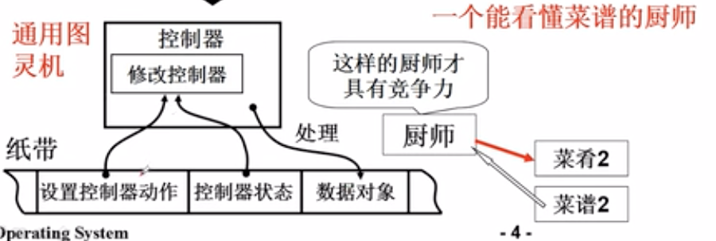
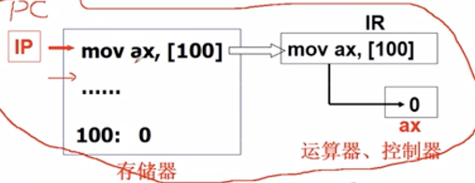

# 计算机操作系统
为学习EVM做一些知识铺垫

参考资料：

[【哈工大】操作系统 李治军（全32讲）-哔哩哔哩](https://b23.tv/Here0ei)
[TOC]

# 什么是操作系统
## 介绍
用计算机解决实际问题。比如在屏幕上输出"hello"：
* CPU发出指令给内存。
* 内存发送在某个地址储存的"hello"，把数据一点点通过总线传到图形控制器。
* 图形控制器在显示屏上输出。

但我们平时可以直接调用c语言函数来运行，不需要麻烦的直接操作计算机硬件。正是因为操作系统在使用计算机硬件的时候才会简单高效。操作系统就是包在计算机硬件与应用之间的一层软件，方便使用硬盘，显示器。本课程主要讲解操作系统的几个基本部分：
* CPU管理
* 内存管理
* 终端管理
* 磁盘管理
* 文件管理

## 揭开钢琴的盖子

在应用程序层面调用操作系统接口的话就无法更改操作系统，在操作系统内做操作。

### 开机的时候发生了什么
图灵机是一种模型，人思考的时候先在纸上看到问题，加载到脑袋里，并把结果写到纸上。
* 控制器从纸带读取数据
* 控制器通过逻辑计算数据
* 把结果写到纸带上。

但这样的控制器只能处理一种逻辑。于是有了通用图灵机的概念：

通用图灵机的控制器通过把程序载入到控制器中来控制不同的计算逻辑。接着又有了储存程序的思想：

计算机将程序和数据储存在内存中，计算机在程序的控制下一步步进行处理，这叫做取指执行。计算机分为五大部件：输入设备，输出设备，储存器，运算器，控制器。

### 打开电源的时候，计算机执行的第一个指令

