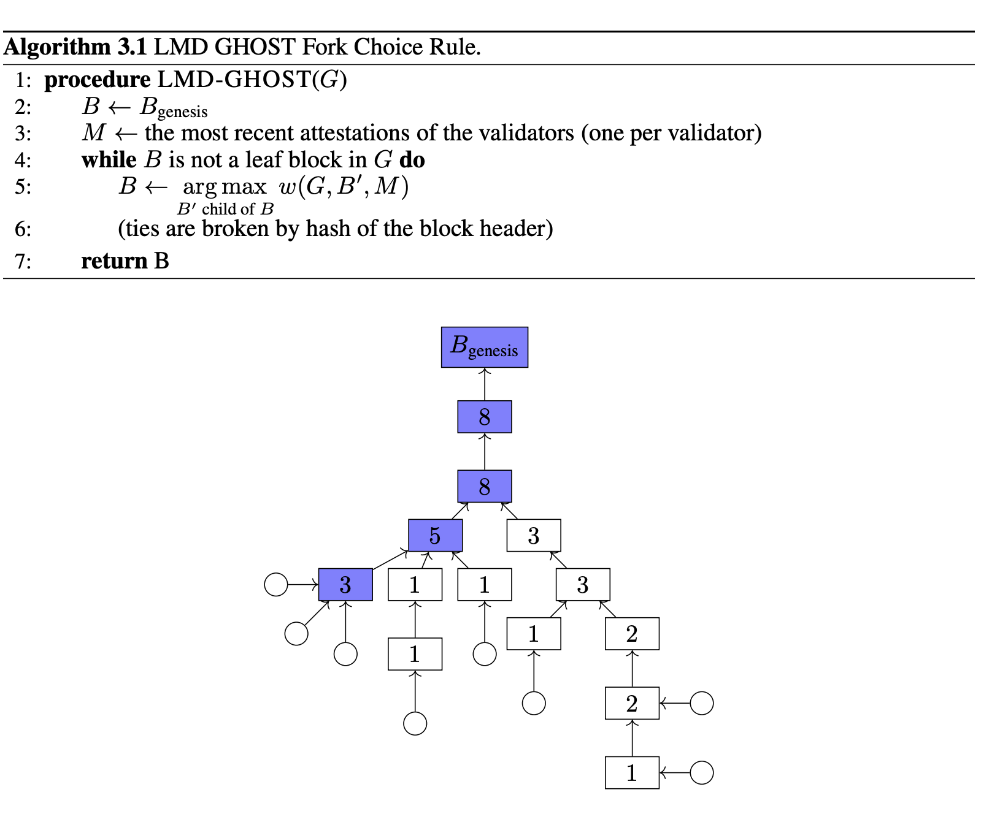

# Gasper共识
本文学习以太坊的Gesper共识机制，参考文档：

~~[Ethereum2.0共识协议Gasper分析](https://al3ul0osmp.feishu.cn/wiki/wikcnVN9f4Cg6yXFDS1RWhYB9Nh)~~ 此文有一些事实性错误且说明不明确，只做参考。
[TOC]
# Gasper是什么
Gesper是Casper FFG与LLMD GHOST结合的算法。Casper是为了解决最终确认算法，Ghost为了解决分叉问题。
## 概括
### Casper
构建区块链的参与者validator在本地维护一个区块链视图G，包含区块和两个区块之间的edge。attestation是validator为每个edge投票，投票的权重是质押财产的数量。每个validator进行投票并广播，在本地选择weight> $\frac{2N}{3}$ 的edge。Casper 定义了两个条件validator的质押会被罚没。首先定义：
* checkpoint：block number为H的整数的block。
* 函数h，h（check point） = check point/H，即返回check point序号
* s->t：表示一个attestation，s、t分别是一个check block，h(t)>h(s)

Slashing condition是：
* validator不能对这样的两个检查点投票：s1->t1, s2->t2, h(t1) = h(t2)
* validator不能对这样的两个检查点投票：s1->t1, s2->t2, h(s1) < h(s2) < h(t2) < h(t1)

### GHOST
LMD-GHOST是一个链分叉算法，输入本地视图G输出最可信的链

子节点的投票会累加到父节点上，分叉时选择投票最多的子节点。
### Gasper
将两者结合得到一个简单的Gasper算法：
* 创世区块是被确认的，任何edge s->t需要s被确认，如果得票超过 $\frac{2N}{3}$则t被确认。
* 如果一个被确认的块B后k个块被确认，那么这个块被最终确认。

流程：
* 当前的checkpoint为BB
* 每隔一段时间一个出块者提出一个新块并广播
* validator根据本地视图为两个决策投票：
    * GHOST投票，选出投票最多的链
    * Casper投票，为这个epoch的BB与前一个epoch的checkpoint J投票： J->BB

通过不断运行2与3步对每个新block投票并最终确定checkpoint。

## Gasper细节
### 诚实验证者行为
#### Epoch Boundary Blocks and Pairs
Gasper的设计中使用了有边界的半异步网络，每个消息都在一个时间片段里。在时间片段开始后的t时间单位后同步到其他节点。为了达到半异步可以容忍本地validator接收到的消息的时间戳比本地时间往后。以太坊规定1slot为12s，1epoch为32slot。

Epoch boundary block是每个epoch开始的区块，当epoch没有开始的区块会转而使用上一个epoch最后的区块。通过从检查点开始算法可以不需要从过早的区块开始验证。

#### committees
每个epoch选取的validator会被随机分配给一个slot，并选择一个出块人。

