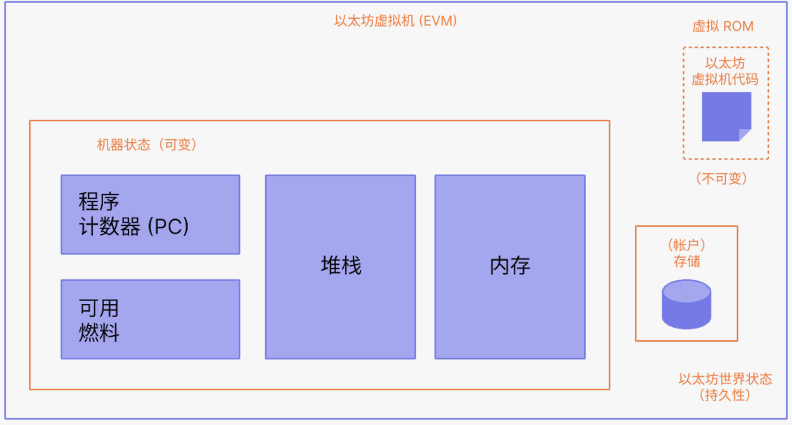
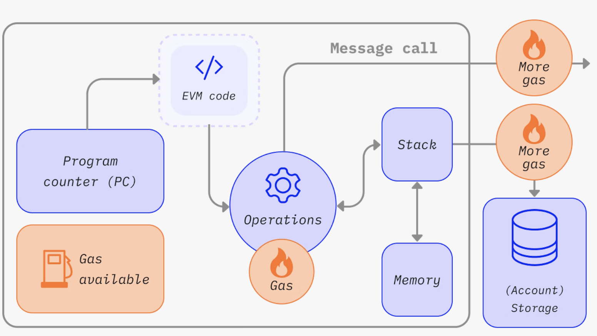

# 以太坊学习
本文档用于记录学习以太坊
[TOC]
# 术语
#### 什么是区块链
区块链通过区块之间引用父块和共识机制的数据库，以此来保障区块链中每一个块都需要整个网络的共识。以太坊使用权益证明共识，验证者必须质押以太币。

#### 以太坊
以太坊是一条区块链并包含一个以太坊虚拟机（EVM）。每个节点都可以储存一个EVM的状态并广播请求计算，请求计算后每个节点都会检查、验证并执行计算并广播新的状态变化。‘

#### 智能合约
每次以太坊交易不会重写代码，而是由程序开发者将程序上传到以太坊虚拟机，申请交易者请求使用不同的参数来执行这些代码片段。我们将这些代码片段称为智能合约。

#### 以太币
以太币是以太坊上的原生货币，用于激励不同的人贡献计算资源。任何广播交易都需要支付一定量的奖励来作为提供计算资源的补偿。以太币还通过鼓励指出不诚实行为，抵押货币和对新提议区块的投票来保证网络安全。

###### 以太币铸造与燃烧
以太币在创建新块的时候被铸造，提出交易的时候被燃烧。铸造的新币约$\frac{1}{8}$会给提议者，其余给验证者分配。每当提出交易时需要设定最高燃料费，其中网络会根据交易需求销毁基础燃料费。这样的机制可以让以太币发行量更加平衡并让交易费更加透明。

###### 以太币面额
以太币提供更小的面额来完成交易。：

|面额|ETH值|用途|
|----|----|----|
|Wei|$10^{-18}$|技术实施|
|Gwei| $10^{-9}$|燃料费|

#### 去中心化应用
去中心化应用（DAPP）以智能合约为基础在以太坊虚拟机上运作。

#### Web3
Web3的概念是不需要中心互联网公司而在区块链上运作的去中心化程序。Web3不需要授权，没有人能拒绝访问且图灵完备，但可扩展性和性能差。

#### 账户
以太坊有两种账户：
* 外部所有的账户（EOA），由任何有私钥的人控制。
* 合约帐户，部署到网络上的智能合约，由代码控制。

两者都可以接收发送ETH和token，与已部署的智能合约交互。区别在于合约账户由智能合约的代码逻辑控制而非私钥，需要成本来使用网络储存空间。
###### 数据结构
以太坊账户有四个字段：
* nonce：一个计数器，任何账户可以发起交易或创建合约的数量的最大值，为一个随机数，用来避免重防攻击。
* balance：账户中Wei的数量。
* codeHash：EVM上的账户代码，用以执行合约账户的代码片段。外部账户的codeHash为空字符串的哈希。
* storageRoot：对账户储存内容的哈希编码，默认情况为空。

###### 账户创建
外部账户创建时生成私钥，合约账户在合约部署到以太坊链时给出，在POS中还有验证者密钥，用来识别验证者。
#### 交易
交易是由账户发出，来更新以太坊网络的状态。提交的交易包括：
* from：发送者地址（只能是外部用户）
* to：接收地址，传输交易值或运行合约代码。
* signature：发送者的标识符，用私钥签署交易。
* nonce：表示账户的交易数量。
* value：转移的以太币数量。
* inputdata：可以包含任意数据的可选字段。
* gasLimit：最大燃料费。
* maxPriorityFeePerGas - 作为小费提供给验证者的已消耗燃料的最高价格
* maxFeePerGas - 愿意为交易支付的每单位燃料的最高费用（包括 baseFeePerGas 和 maxPriorityFeePerGas）

###### data
data字段前四个字节使用函数名称和参数的哈希指定执行函数，后面的数据为传入参数。

###### 交易类型
* 常规交易：从一个账户到另一个账户。
* 合约部署交易：没有to地址，data用于合约代码。
* 执行合约：与已部署合约进行交互，to为合约地址。

###### 关于燃料
常规交易需要21000单位燃料。根据maxFeePerGas可以得到转账所需要付的燃料费。所有未用于交易的燃料费都会退还给账户。

###### 交易生命周期
交易提交后，会被广播到各个节点、被验证者加入区块、最后确认区块。一旦区块被最后确认只能通过上十亿美元的攻击才能更改。

#### 区块
###### POS
* 区块的验证者需要质押32以太币，来防止不良行为。
* 每个slot中（12秒），会随机选择一个验证者提议区块，将交易打包运行到下一个状态并把区块传送给其他验证者。
* 验证者计算并同意下一个状态。
* 如果有两个冲突的区块，验证者将用分叉选择区块选择质押以太币最多的区块。

###### 区块数据结构

* slot：区块所属的时隙。
* proposer_index：提出区块的验证者id
* parent_root：上一个区块的哈希。
* state_root：状态对象的根哈希。
* body：定义如下

body的数据结构：
* randao_reveal用于选择下一个区块提议者的值。
* eth1_data：关于存款合约的值。
* graffiti：用于标记块的任意数据。
* proposer_slashings：将要惩罚的验证者列表。
* attester_slashings：将要惩罚的证明者列表。
* attestations：支持当前区块的认证列表。
* deposits：存款合约新增的存款。
* voluntary_exits：退出网络的验证者列表。
* sync_aggregate：用于服务轻客户端的验证者子集。
* execution_payload：从执行客户端传来的交易。

attestations的数据结构：
* aggregation_bits：参与认证的验证者列表。
* data：见下。
* signature：所有认证验证者的聚合签名。

attestation 中data的数据结构：
* slot：认证从属的时隙。
* index：证明验证者的索引。
* source：上一个合理的检查点。
* target：最新的时段边界区块。

body中exclution_payload中的所有交易被执行会改变虚拟机状态，所有客户端执行其中的交易并确保新状态与state_root的状态相同。exclution_payload_header的数据结构：

* parent_hash：父块的哈希值。
* fee_recipient支付交易小费的地址。
* state_root应用此区块更改后的全局哈希。
* receipts_root：交易数据树的哈希。
* logs_bloom：包含事件日志的数据树。
* prev_randao：随机选择验证者用的值。
* block_number：当前区块编号。
* gas_limit：区块允许的最大燃料。
* gas_used：区块使用的实际燃料。
* timestamp：区块的时间。
* extra_data：作为原始字节的任意附加数据。
* base_fee_per_gas：基础费值。
* block_hash：执行区块的哈希。
* transactions_root：有效负载中交易的根哈希。
* withdrawal_root：有效负载中提款的根哈希。

exclution_payload与header相同，但是包含的是交易和提款的列表而不是根哈希。

withdraw的数据结构：
* address：提款账户地址。
* amount：提款金额。
* index：提款索引值。
* validatorIndex：验证者索引值。

###### 区块大小
区块大小目标为1500万燃料单位，最高可以是3000万。限制区块大小可以限制处理区块所需要的性能来控制集中化。

#### 以太坊虚拟机
比特币使用分布式账本，通过密码学和一套规则来限制对账本的操作。与此不同，以太坊使用使用智能合约和分布式状态机。以太坊的状态是一个大型数据结构，不仅保存账户和余额也保存一个机器状态。以太坊中状态的改变由EVM定义。

EVM可以被定义为一种转换函数，通过输入来改变输出：
$$
Y(S,T) = S'
$$
即给定一个旧状态和一个交易得出新的状态。在以太坊环境中，状态是一种称为改进版默克尔帕特里夏树的巨大数据结构，它保存所有通过哈希关联在一起的帐户并可回溯到存储在区块链上的单个根哈希。

###### EVM说明
EVM作为一个堆栈机运行，栈的深度为1024项。每个项目都是256字节。为了便于使用，选择了 256 位加密技术（如 Keccak-256 哈希或 secp256k1 签名）。已编译的智能合约码执行标准的堆栈操作，以及EVM中定义的一些区块链特定操作。

#### 燃料
以太坊燃料代表进行特定操作需要的计算量，来避免恶意操作的攻击。燃料话费为燃料单位乘以每单位燃料成本。

以太坊的燃料基础费用通过上一个区块的大小得出。如果上一个区块的大小大于预期大小则会使基础费用上升12.5%，这使得区块大小始终处于高位是经济上不可行的。

#### 节点和客户端
节点是运行以太坊客户端的实例，与其他节点连接形成网络。一个节点需要运行两种客户端：
* 执行客户端：执行客户端收集广播的交易并在EVM中执行，储存最新的以太坊状态和数据库。
* 共识客户端：完成POS，使网络中的执行客户端保持一致。

节点类型包括：轻节点，全节点和归档节点。

###### 全节点
全节点通过创世区块或更新的受信任的区块验证每一个历史区块。
* 储存区块链的所有数据，会定期修剪所以不包含过早的区块。
* 参与区块验证。
* 从本地储存或生成全部状态。
* 为网络提供服务，并要求提供数据。

###### 归档节点
归档节点从创世区块开始验证每一个节点，并不删除区块数据。

###### 轻节点
轻节点只下载区块头，这让移动端参与以太坊成为可能。但是轻节点不能参与共识，这可能是未来发展的一个方向。

#### 网络

###### 以太坊主网
以太坊主网是目前运行的以太坊生态的网络，所有ETH交易都运行在这里。
###### 以太坊测试网
测试网可以模拟以太坊协议的环境，用来测试升级协议和智能合约。
###### 二层测试网络
二层网络 (L2) 是一种统称，用来描述一系列特定的以太坊扩容解决方案。 二层网络是一条扩展以太坊并继承以太坊安全保障的独立区块链。 二层网络测试网通常与公共以太坊测试网紧密关联。

###### 私有网络、开发网络
不连接主网或测试网的网络，当开发以太坊程序的时候需要先在私有网络上测试再部署。
###### 联盟网络
联盟网络的共识由一系列受信任的节点控制。

#### 共识机制
###### POW
矿工竞争解决数学问题来提出新区块，拥有更好计算资源的节点能更快提出新块。对POW共识的攻击需要掌握51%的算力。
###### POS
验证者创建区块。 每个时隙中都会随机选择一个验证者成为区块提议者。 区块提议者的共识客户端请求配对执行客户端对交易打包，作为“执行负载”。 然后它们将“执行负载”包装成共识数据并形成一个区块，再把这个区块发送给以太坊网络上的其他节点。 这样的区块生产会得到以太币奖励。 在极少数情况下，一个时隙中产生了多个可能的区块，或节点在不同时间收到区块，分叉选择算法就会选择使形成的链具有最大认证权重的那个区块（认证权重是指为该区块提供认证的验证者数量，并根据验证者质押的以太币余额调整）。

###### 女巫攻击和链选择
POS和POW通过消耗计算资源或质押货币来抗衡女巫攻击（一个用户假装成许多用户）。当链分叉的时候我们也需要链选择算法。POW使用最长链原则，因为最长链需要投入更多计算资源。POS会通过质押货币来计算链的权重。

# 总结
本文本以以太坊开发文档的基础单元总结了以太坊的基本思想，术语和简单的数据结构。通过本文档总结接下来主要的内容为：
* EVM，堆栈机，*计算机操作系统
* 以太坊的POS共识：Gasper
* 加密算法中用到的哈希原理：Keccak-256, secp256k1, SHA-256
* 学习Rust，学习EVM源码。
