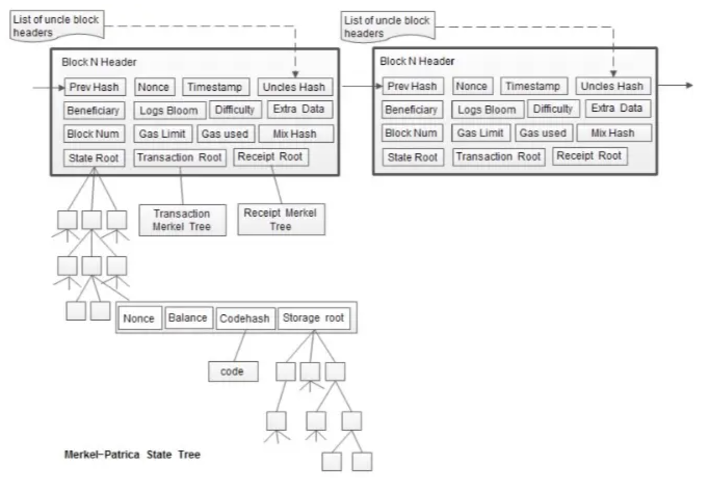
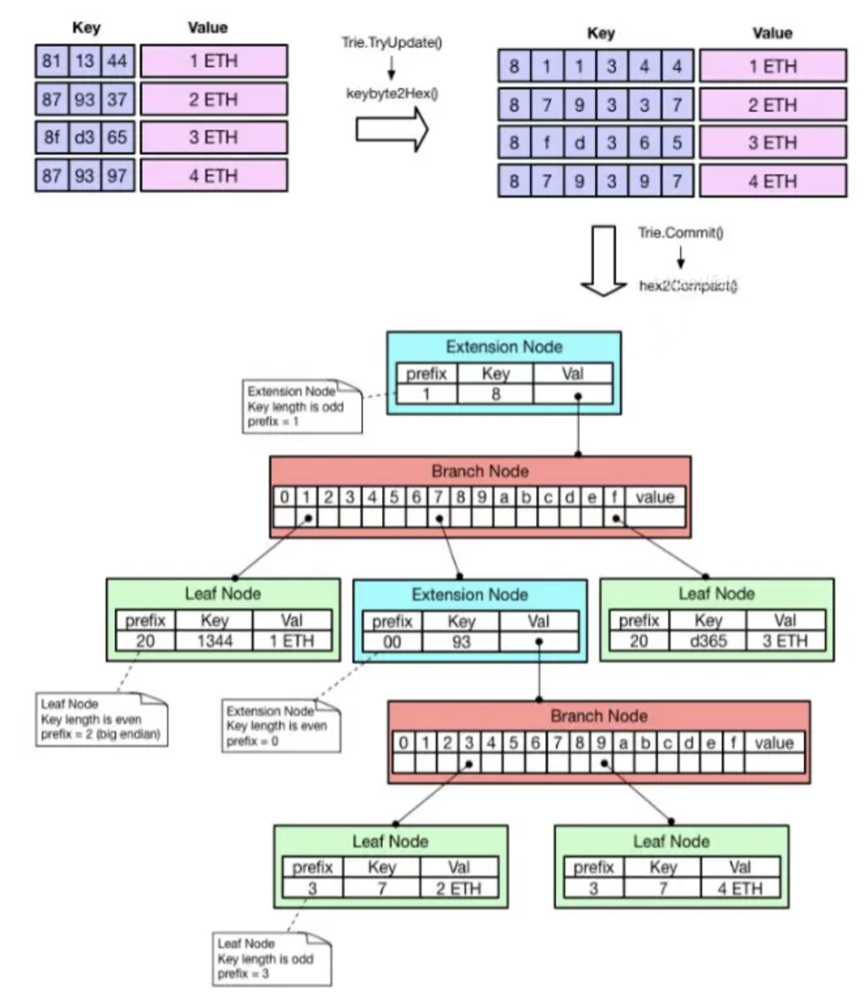
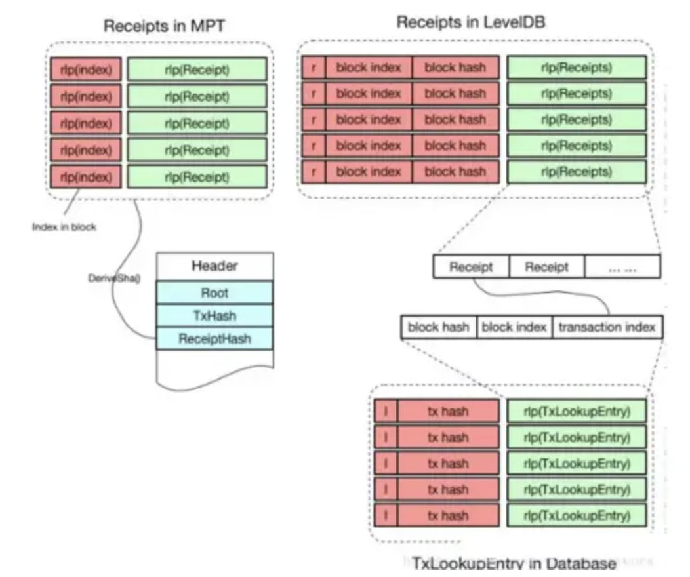

# 以太坊数据结构
本文延续比特币基础，学习以太坊的数据结构、各种树的实现。本文基于资料： 

[【深度知识】以太坊区块数据结构及以太坊的4棵数
](https://learnblockchain.cn/2020/01/27/7c1fcd777d7b)

[以太坊概述——数据结构 与 共识机制](http://xplanet.site/wp-content/uploads/2023/11/8-%E4%BB%A5%E5%A4%AA%E5%9D%8A%E6%A6%82%E8%BF%B0%E6%95%B0%E6%8D%AE%E7%BB%93%E6%9E%84%E4%B8%8E%E5%85%B1%E8%AF%86%E6%9C%BA%E5%88%B6.pdf)
[TOC]

# 树结构
树结构主要的内容：

* 区块数据结构
* 数据结构基础
* 以太坊的4棵树
* 状态树
* 交易树
* 收据树
* 账户存储树

## 区块储存的树数据
每个区块包含区块头，交易列表与叔区块。区块头中除了包括区块哈希，父区块哈希和一些基本信息，还包含了三个树的根哈希：State Root, Transaction Root, Receiption Root分别代表状态树，交易树，收据树的根哈希。

## 以太坊的树

*可在数学文档找到树的数学介绍[数学工具](../math/math_operation.md)*

以太坊区块中有三个树：状态树，交易树，收据树。整个以太坊世界只有一个状态树，保存所有账户信息。每个区块保存一个交易树一个收据树，用来记录交易和交易收据信息。以太坊中的树使用MPT

账户储存树保存合约账户的数据。

在以太坊中使用MPT有很多好处，首先比特币中MT只是用于在块中验证交易数据，并不会经常改动。但是以太坊中状态树要频繁的改动，任何新增的账户在MT中都可能造成整个MT需要重构（新的用户的哈希插在MT中间）。不排序的MT也会给查询造成困难。所以MPT对于以太坊状态树这种需要频繁的更改查询新建用户的树十分好维护。

### 状态树
状态树有四种节点：
* 空节点：表示空
* 叶子节点（leaf）：表示一个kv键值对，key是key的一种16进制编码，value是value的RLP编码。
* 扩展节点（extension）：也是一个kv键值对，但是value是其他节点的hash值，也就是指向另一个节点。
* 分支节点（branch）：因为以太坊中key被编码为16进制，所以每个分支节点是一个长为16的list连接其他节点以及一个value如果分支节点本身映射到一个值。

### stateDB的储存
stateDB中储存了许多stateObject，每一个state object代表了一个账户的信息。包含地址，余额，nonce，合约代码哈希等信息。数据通过RLP编码之后哈希为key，RLP编码为value储存并查询。所有账户的当前状态叫做世界状态。为了能够快速检索查询账户状态，以太坊使用三级储存：

* map形式储存的stateDB
* MPT形式储存
* levelDB持久储存

每当在上一级储存中没有找到需要的信息的时候再调用下一级数据库查询。

### 交易树
在MPT中储存的交易以交易在块中的位置的编码为key，来储存交易的编码。交易在levelDB中并不单独储存，levelDB中会储存一个Txhash-Txlookupentry的键值对来查询交易位置，Txlookupentry中储存来块哈希，块位置和index来定位交易的位置。

levelDb中的不同数据使用不同前缀储存，来快速区分数据属于哪个类型。

### 收据树
收据树在levelDB中储存，由于收据和交易一一对应，所以可以直接通过查询`TxLookupEntry`来找到对应的收据

收据树中还储存了一个布隆过滤器，根据交易信息得出。在区块头中有一个所有收据布隆过滤器并集，用来支持快速查询交易是否在块中。

### 账户储存树
回顾账户的数据结构，除了nonse 和balance，合约账户还储存了账户储存树根哈希和储存的EVM代码地址哈希。当在世界状态中找到账户信息的时候就可以查到合约账户的账户储存树，储存树使用MPT储存了智能合约的变量数据。

# 数据结构
## 账户数据结构
以太坊账户通过账户地址储存在状态树中。账户地址的生成流程：
* 生成随机私钥（32bytes）
* 采用椭圆曲线数字签名算法ECDSA-secp256k1 计算公钥X,Y (65bytes)
* 使用KECCAK256生成32bytes哈希
* 取其中后20bytes生成地址。

对外部所有账户有两个主要数据
* nonce：计数交易次数
* balance：储存账户余额

在以太坊中由于使用账户记账的模式，一次交易之后并不会有对应的UTXO失效，所以一个比特币式的交易会产生交易重放的问题。所以在签名之外以太坊交易还要包含用户所产生的交易数，并与目前用户的交易数对比来防止重放。

nonce还有一些功能：
* 通过nonce控制交易顺序
* 通过重复提交有相同nonce的交易来使先前的交易不合法，一定程度上实现交易撤销。

