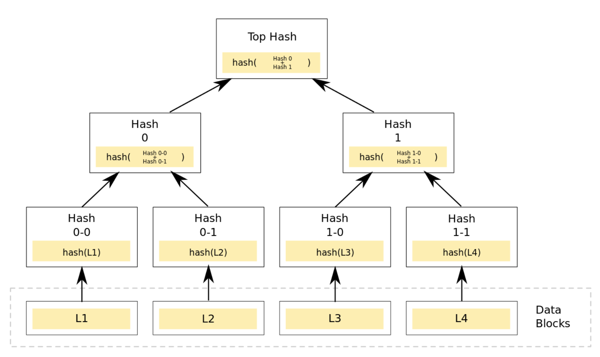
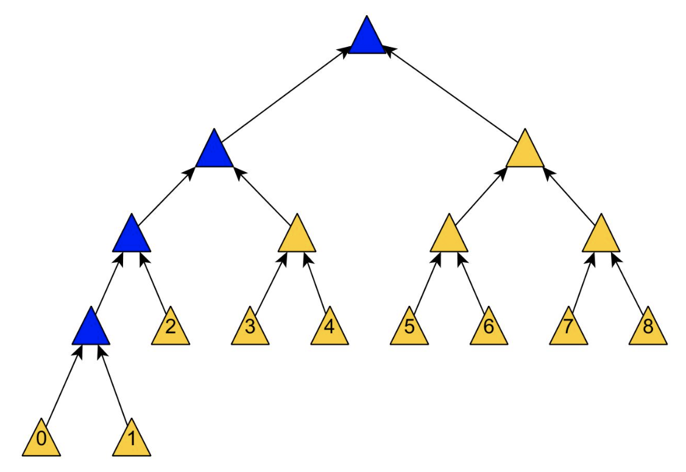
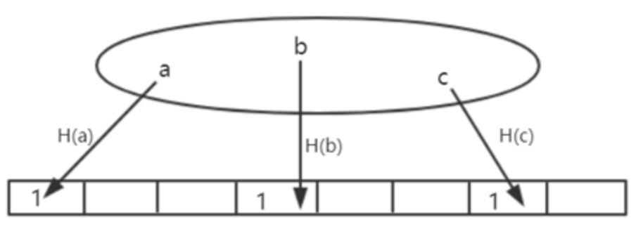
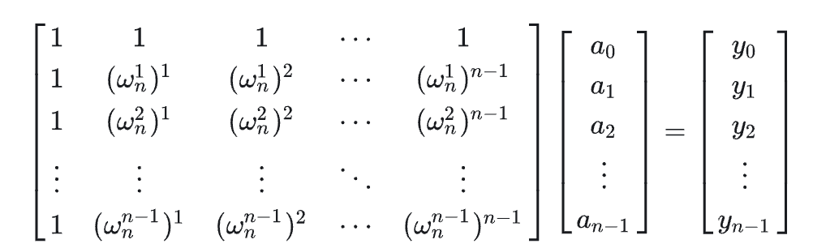
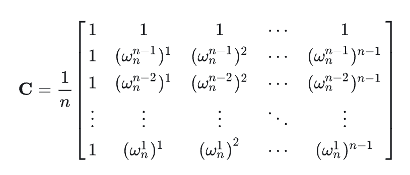

# 数学工具
为了避免麻烦和重复把所有数学工具在这里总结
[TOC]
# 加密算法

## 椭圆曲线加密签名（ecdsa）

### 椭圆曲线

数学上的椭圆曲线是一个满足
$$
y^2 = x^3 + ax + b \qquad 4a^3+27b^2 \neq 0
$$
的曲线，为了防止奇点存在（尖点、自相交、孤点）。椭圆曲线在加密算法中的重要性质是关于x轴对称。

### 椭圆曲线运算

#### 阿贝尔群

椭圆曲线的计算按照阿贝尔群（加法的阿贝尔群）定义，阿贝尔群中对元素的加法满足交换律。群可以记为G，且有：
* 封闭性，G中A+B应该也在G中。
* 结合性，G中A+B+C = A+(B+C)
* 单位元，在G中存在一个元素e，对于所有a：a+e = e+a = a
* 逆元，在G中对于任意a存在b，a+b=b+a=e

#### 椭圆曲线的加法

椭圆曲线加法的定义是对于椭圆曲线上任意两点A, B。A+B为AB直线与G交点对于x轴的对称点。很好确认这个加法的封闭性。逆元的定义是A关于x轴的对称点，单位元是无穷远。同时可以定义点的两倍是椭圆曲线切线与椭圆曲线的交点关于x轴的对称。通过这个定义可以计算nA。
##### 推导
对于任意两个点P、Q在椭圆曲线上：
$$
y_p^2 = x_p^3+ax_p+b
$$
$$
y_q^2 = x_q^3+ax_q+b
$$
相减：
$$
(y_p-y_q)(y_p+y_q) = (x_p-x_q)(x_p^2+x_px_q+x_q^2)+a(x_p-x_q)
$$
$$
\lambda(y_p+y_q) = x_p^2+x_px_q+x_q^2+a \qquad \text{where }\lambda = \frac{y_p-y_q}{x_p-x_q}
$$
这个等式具有对称性质，交换PQ的时候仍然成立。进一步引入R点：
$$
\lambda(y_p+y_q) = x_p^2+x_px_q+x_q^2+a
$$
$$
\lambda(y_p+y_r) = x_p^2+x_px_r+x_r^2+a
$$
$$
\lambda(y_r+y_q) = x_r^2+x_rx_q+x_q^2+a
$$
因为我们认为三个点交于一条直线，所以可以设定同一个$\lambda$。将等式2、3相减：
$$
\lambda(y_p-y_q) = x_p^2-x_q^2 +x_r(x_p-x_q)
$$
$$
x_r = \lambda^2-x_p-x_q
$$
$$
y_r = \lambda x_p-\lambda x_r-y_p
$$
若为点加倍则计算切线，更改$\lambda = \frac{3x_p^2+a}{2y_p^2}$

通过$x_r$的计算可以看出这个加法群是符合交换律的，所以是阿贝尔群。剩下的需要证明结合律。由于符合交换律，可以通过证明三点相加的结果对三个点的循环交换相同来证明结合律：

$$
不会
$$

### 有限域

因为光滑的椭圆曲线很容易被找到规律所以要把椭圆曲线定义在一个有限域上。有限域中的元素个数成为阶。
#### 椭圆曲线的有限阶
如果对于一个点P存在最小n使得
$$
nP = O
$$
则称n为P的阶。在椭圆曲线中使用mod p来定义有限域，记为$F_p$
$$
\{(x,y)\in {F_p}^2 | y^2 = x^3+ax+b \mod p , 4a^3+27b^2\neq 0\}\cup\{0\}
$$

椭圆曲线在$F_p$上关于$y=p/2$对称。

#### 点加
在有限域中的点加与实数域类似，在同一条直线上的三个点相加为零。在有限域中直线的定义为：
$$
ax+by+c = 0\mod p
$$
通过寻找在同一条线上的椭圆曲线并对$y=p/2$取对称来找到相加点。通过类似实数的推导可以得到：
$$
m = (y_P-y_Q)(x_P-x_Q)^{-1}\mod p
$$
$$
x_R = (m^2-x_p-x_Q) \mod p
$$
$$
y_R = [y_p+m(x_R-x_P)]\mod p
$$
#### 标量乘法
标量乘法可以通过先成二再加1的方式递归的得到。在有限域中一个点的标量乘法可以构成一个循环子群，其中存在一个点可以通过标量乘法生成循环子群中所有的元素，称为生成元。
### 加密流程
椭圆曲线加密基于给定PQ且$Q=kP$的时候很难得出值k。ECDSA中使用的签名流程为：
#### 公私钥生成
* 选择椭圆曲线，基点G，基点G的阶n
* 在小于n中选择私钥d
* 计算公钥$Q = dG$

#### 签名流程
* 选择随机数r，计算$R = kG$，将R的x值记为r
* 计算$s = k^{-1}(m+rd)\mod n$，$(r,s)$ 为签名
* 通过得到的m计算$u_1 = ms^{-1},u_2 = rs^{-1}$
* 验证 $P = u_1G+u_2Q$

#### 证明
将$u_1 u_2$代入验证共识可以得到：
$$
P = mk(m+rd)^{-1}G + rk(m+rd)Q
$$
$$
P = mk(m+rd)^{-1}G + rk(m+rd)dG
$$
$$
P = (rd+m)k(m+rd)^{-1}G 
$$

#### 安全性
所有椭圆曲线点的标量乘法都是不可逆的，这样就保护了私钥，明文哈希，随机数不被篡改。保证了安全性，不可篡改，不可否认，且签名同等安全性下的密钥长度币RSA等算法更短。被广泛用在比特币以太坊中的数字签名。 
# 树们

## merkle tree
merkle tree也叫哈希树。它的非叶节点都是由它下面连接的两个子节点的哈希计算，叶节点表示某个数据的哈希。见图：

在某一层的叶节点数量为奇数时会复制最后的叶节点来计算。mt的功能有很多，比特币出现之前经常作为p2p文件下载（如BT）、数据库系统等中用于校验文件完整性、可信性。比如在BT下载时先向可信信源获得mt root并与下载源的文件mt进行校验。

在比特币中mt也保障交易不被篡改，并可以把交易信息打包放入区块头中。同时mt提供了轻量的验证方式使得轻节点也可以在不下载交易数据的情况下校验merkle tree：

如图，为了校验交易0可以向全节点申请路径上的所有mt叶子节点进行验证，复杂度为$O(log(N))$
### 攻击: Second preimage attack

对于mt可以使用重放攻击。因为在叶子节点为奇数的时候要复制最后一个节点，所以体现在叶节点上通过重复最后的一些叶节点可以伪造拥有同样mt root的不同mt。在比特币中使用这样的攻击可以广播拥有同样交易的假mt，来让原本的块不受矿工信任。可以通过在叶节点前面添加0x00前缀，在内部节点前添加0x01前缀来防止这种攻击。

## Trie Tree
又称前缀树、字典树。Trie Tree 除了根节点每个子叶节点都包含一个字符，从根节点到叶节点路上所有的字符构成一个关键字来查询值。通常每个子节点除了包含它代表的字符外还包括一个确认值来表示这个子节点是否也构成一个关键字，如图：

### 优缺点
* 查询更快，查询时间复杂度为$O(M)$，取决于查询关键字的长度。与此相对哈希表的查询效率有赖于哈希函数的设计。
* tt中不同关键字不会冲突。
* 只有允许一个关键字关联多个值的时候才会发生类似于哈希碰撞的事情。
* tt不需要计算哈希值，对短关键字的效率更高。
* tt可以根据字典顺序排序关键字。
* *哈希函数设计的好的时候tt查询效率更低*
* *空间消耗比较大*

### 应用
通过定制子节点数据结构可以做到多种功能。比如查询关键字（在子叶节点添加bool值判断是否有此关键字），查询词频（在子叶节点加计数器）。

单词排序，按照字母表排序深度优先遍历tt。

前缀匹配，找到前缀子节点并遍历子节点下单词。

...

## Partricia Tree
压缩前缀树。相对于Trie，如果子节点是唯一的子节点则与父节点合并，更节省空间。

以太坊中就是使用一种Merkle Partricia Trie。

# 以太坊中的编码

MPT中有三种编码：keybytes, Hex, Compact
* keybytes 是key的原生表示。
* Hex为了能插入到16进制的MPT中，要把keybytes表示的一个byte拆成两个分别作为一位Hex编码。并且转换编码后会在最后一位加上一byte的16来标志Hex编码
* 在储存MPT到DB的时候需要把Hex编码换回1byte的编码。有时一个Hex编码可能只有奇数位，所以Compact编码会添加额外前缀：
    * 扩展节点偶数：00
    * 扩展节点奇数：1
    * 叶子节点偶数：20
    * 叶子节点奇数：3

每次转换Compact编码到Hex编码先读取前缀判断奇偶，奇数时可以理解为Hex的第一位编码被填充0000 。
## RLP编码
递归长度前缀（RLP）是以太坊发明的编码方式，用来解决数组和嵌套数组的编码储存问题。编码规则为：
* 如果编码为一个值为[0~127]的单字节，编码为其自身。
* 如果编码的byte数组长度小于等于55，前缀为128加长度。
* 如果编码的byte数组长度大于55，编码的第一个前缀是182加数组长度的编码的长度，然后是数组长度本身的编码，然后是byte数组本身的编码。
* 如果列表长度小于等于55，编码结果是192+列表byte长度，后面接子列表的编码。
* 如果列表长度大于55，编码结果第一位是247加列表长度的编码的长度，后面是列表长度的编码本身，最后依次连接子列表的编码。

同时解码的时候也通过编码前缀递归地选择不同的编码规则来解码。这种编码方式减少了其他储存嵌套数组编码的方式（比如json）带来的大量无用的储存信息的缺点，减少了内存的占用。

# Bloom filter
布隆过滤器是一个可以快速查找一个数据是否在集合中的数据结构。对每一个集合中的数据计算三个哈希并对哈希值对应的值设置为1 。在查询的时候计算三个哈希并查看是否对应值为1就可以确定这个数据有可能在集合中，可以进行进一步的查询。

在以太坊中，每个交易会产生一个收据，每个收据里面包含一个布隆过滤器来保存交易信息。在每个区块头中也有一个布隆过滤器来支持快速查找交易是否在区块中。

# 快速傅立叶变换
对于两个多项式$A(x)$，$b(x)$。我们想求它的乘积：
$$
\sum_{i = 0}^n a_i x^i\times\sum_{i = 0}^n b_i x^i
$$
如果只在这种视图下进行计算需要$O(n)$的复杂度。后面提出FFT可以在$O(nlogn)$复杂度处理多项式乘积。
## 多项式系数与点值表示
多项式的系数表示就是一系列按顺序的系数$(a_0, a_1\ldots a_n)$。通过这种形式可以唯一的确定多项式$F(X) = \sum(a_i x^i)$。

同样还可以用点表示多项式。因为一个n阶多项式可以通过n+1个点来确定：
$$
\exist \{x_i\}_n\quad \tau(f) = \{(x_i,f(x_i))\}_n
$$
现在对于两个多项式的乘法：
$$
\tau(f) = \{(x_i,f(x_i))\}_n \quad \tau(g) = \{(x_i,g(x_i))\}_n
$$
可以用点值表示乘积：
$$
\tau(fg) = \{(x_i,f(x_i)\times g(x_i))\}_{n+m}
$$
这样就可以$O(n)$复杂度计算乘法。如果能找到一个方法把多项式从系数法转换到点值法，计算完乘积后转换回系数法就可以用较低时间计算多项式乘法。
## 单位根
n次单位根定义为：
$$
w_n = e^{i \frac{2\pi}{n}} \quad w_n^k = e^{i \frac{2k\pi}{n}}
$$
## 快速傅立叶变换
假设多项式的阶数$n = 2^s$，可以把多的项数填充0 。有：
$$
f(x) = (a_0 + a_2x^2+ \ldots + a_{n-2}x^{n-2}) + x(a_1 + a_3x^2 + \ldots + a_{n-1}x^{n-2})
$$
设：
$$
f_1(x) = a_0 + a_2x+ \ldots + a_{n-2}x^{n/2-1}
$$
$$
f_2(x) = a_1 + a_3x + \ldots + a_{n-1}x^{n/2-1}
$$
则：
$$
f(x) = f_1(x^2) + xf_2(x^2)
$$
代入$x=w_n^k$：
$$
f(w_n^k) = f_1(w_{n/2}^k) + w_n^k f_2(w_{n/2}^k)
$$
代入$x=w_n^{k+ \frac{n}{2}}$：
$$
f(w_n^{k+ \frac{n}{2}}) = f_1(w_{n/2}^k) - w_n^k f_2(w_{n/2}^k)
$$

可见只要不断求出$f_1(w_{n/2}^k)$和$f_2(w_{n/2}^k)$就可以递归的求出$f(x)$。递归最后是$f_1(w_1^k) = f_2(w_1^k) = 1$, 这样就可以在$O(logn)$复杂度计算两个点值，总共需要$O(nlogn)$

## 快速傅立叶逆变换
对普通的离散傅立叶变化可以用矩阵表示：

同时有：
$$
x^n-1 = (x-1)(\sum_{i = 0}^{n-1} x^i) = 0
$$
这里有两种情况，$x=1$时右括号等于n。或者右括号等于0 。并且对于n次单位根有$x^n = 1$。受此启发可以得到离散傅立叶逆变换：
$$
( (w_n^{n-i})^k\times(w_n^{j})^k )_{k} = \sum_{k = 0}^{n-1} ( w_n^{n-i+j} )^k = n(i = j) \quad0(i \neq j ) \\
$$
可以得到逆矩阵：

相当于给每个矩阵元取模，所以逆变换可以通过在FFT递归的时候乘以的单位元换成共轭复数就可以。
