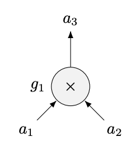

# zk_snark学习
本文学习zk-snark的理论，参考：

[零知识证明算法 zk-SNARK调研 (上)](https://rujia.uk/resource/ZK-SNARK.pdf)

[TOC]

# 什么是零知识
本笔记主要针对zk_snark算法以及零知识证明。zk-SNARK 是 Zero-knowledge succinct non-interactive arguments of
knowledge，为了解决证明某个声明为真但又不透露任何秘密信息的知识的算法。
## 要素
零知识证明的系统中有一个验证者（verifier）和一个证明者（prover）。verifier知道prover的一个声明是正确的，但又不知道任何隐私信息。过程中的三个性质：
* 完整性：只要陈述是正确的，证明者就可以让验证者确信。
* 可靠性——如果陈述是错误的，那么作弊的证明者就没有办法让验证者相信。
* 零知识——协议的交互仅仅揭露陈述是否正确而不泄漏任何其它的信息。
## 相关算法
zk_SNARKs, zk_STARKs, BulletProofs是主要应用于区块链的零知识证明算法。他们的性能对比：

zk_SNARKs性能上来说更好，但需要trust setup
## 大致流程
证明-程序计算-算数电路-多项式-证明多项式
# zk_SNARK多项式原理
## 多项式证明
当我们要验证一个长为10bit的数组，希望它所有值都为1。那么验证者为了得到足够的置信度需要验证更多的bit，并且与数组长度成正比。这就导致长度很长的时候这种方案不可行。

在多项式的情况下，对于d阶的多项式，它最多有d个根。并且对于两个d阶多项式它们相减的结果也最多有d个根。于是我们可以设计这样的算法：
* 验证着选择一个点x
* 验证着把x发送给证明者
* 证明者计算多项式的值并发给验证者
* 验证者对比结果是否相同

由于两个不同的多项式最多有d个交点，所以只要x取值范围足够大那么证明者恰好得到相同值的概率就会小很多。这样就可以通过一次验证得到可靠的结果。
## 多项式零知识证明
上面的方法仍然需要双方互相取得信任，如果多项式的值域不够大的话证明者仍然可以通过猜多项式的值来欺骗验证者。
#### 多项式的因式分解
当我们说一个人知道一个多项式的时候，我们认为他知道这个多项式的所有系数。比如对于$c_nx^n + \dots + c_2x^2 + c_1x^1$，证明者声称他知道$\{c_i\}$。当一个证明者声明他知道一个d阶多项式，并且这个多项式有一系列零根$\{x_j\}$。根据因式分解，我们可以找到一个多项式$t(x) = \Pi_{i = 0}^j (x - x_j)$，并且证明者可以通过这个$t(x)$计算$h(x) = p(x) / t(x)$。通过这个思想，我们可以构造新的证明流程：
* 验证者选取r，计算$t = t(r)$，将r发给证明者。
* 证明者计算得到$h(x) = p(x)/t(x)$，计算$h = h(r)$与$p = p(r)$并将p、r发给验证者。
* 验证者验证是否$p = h\cdot t$

这个方案可以实现零知识，但是存在漏洞：
* 验证者知道$t(x)$的情况下（因为是他自己声称的），于是可以随意伪造p、h来满足条件。
* 如果证明者不能任意选取p、h，证明者也可以先构造$h(x)$再计算$p = h\cdot t$
* 如果证明者一定要先选取一个$p(x)$，也无法证明证明者的多项式确实是d阶。

#### 模糊计算
为了避免证明者获得$r$和$t(r)$的值我们通过加密让证明者在不知道r值的情况下给出多项式的值。

我们选择使用模幂来加密r值。模幂有一些特性可以保证证明者在不知道r值的情况下可以计算p、h但是无法得知t，也无法通过$t(x)$生成$h(x)$和$p(x)$来作弊：
$$
c^x\bmod p \cdot c^y\bmod p = c^{x+y}\bmod p
$$
$$
\frac{ c^x\bmod p  }{c^y\bmod p} = c^{x-y}\bmod p
$$
$$
c^x\bmod p \cdot c^y\bmod p \neq c^{xy}\bmod p
$$

实际上被加密的两个数值的乘法无法从已经知道的加密数值得出（第三行）这就使我们的加密方法成为可能。

如何加密多项式：我们通过如下方法加密r：
$$
E_i = g^{r^i}\bmod p
$$
其中g和p构成循环群。接下来证明者就可以通过$E_i$来算得p、h。具体流程如下：
* 验证者：
    * 随机挑选r并计算$E_i$
	* 计算$t(r)$
	* 发送$E_i$给证明者
* 证明者：
    * 计算多项式$h(x) = \frac{p(x)}{t(x)}$
    * 计算：$p = \Pi_{i = 0}^d E_i^{ c_i }$，h同理。
	* 发送p、h给验证者。
* 验证者
    * 验证是否$p = h^t$

这样就解决了上一次验证算法的漏洞。但接下来还有一个问题，证明者可以通过构造h为一个常数，这样通过h和加密后的$t(r)$仍然能得到$p(r) = t(r)^h$。
#### 约束多项式
我们可以通过对加密值偏移来阻止证明者选取随意的值来计算多项式。以离散对数举例：验证者希望证明者以a为底计算幂模，但是我们无法证明证明者确实使用a为底而不是随意选取一个值。那么可以用一下流程：
* 验证者发送一对值$(a, a') = (a,a^{\alpha})$给证明者
* 证明者计算两个值的模幂$(b, b') = (a^c, a'^c)$
* 验证者验证是否$b^{\alpha} = b'$

在这过程中由于离散对数问题证明者都无法获得对方的的$\alpha$和c但是仍然可以证明证明者是以a为底计算。把这个思想运用到多项式证明中：
* 验证者计算$E_i$的同时计算$E_i' = g^{\alpha r^i}$
* 证明者通过E和E'计算p和p‘
* 验证者同时验证$p^\alpha = p'$

因为：

现在整个协议已经足够健壮，但是验证者仍然能通过证明者给出的信息推算出一个多项式。因为费马小定理：
$$
g^{(p-1)x^{i}} = g^{x^i} \bmod p
$$
所以能观测到的多项式系数取值是有区间的，于是可以通过暴力破解得到一个多项式，虽然与证明者所有的多项式可能不是一个，但是仍然获得来关于证明的信息。

#### 零知识证明
最后我们希望验证者无法获得证明者的知识，仍然可以使用偏移，让证明者通过随机偏移传递值给验证者：
$$
random\ \delta, pass\ ( g^{p(r)} )^{\delta}( g^{p(r)} )^{\delta}( g^{p(r)} )^{\delta}
$$
这样可以通过离散对数问题来避免验证者知道证明者的多项式。

## 非交互多项式零知识证明
上面已经定义了一个交互式的零知识证明，但是这证明仍然无法让其他人信服，因为双方可以通过串通来伪造r和$\delta$。我们希望有一个公开可信可以复用的
#### 加密值的相乘
配对操作（双线性映射）是一种数学结构，对于两个加密值$g^a$和$g^b$可以把加密值a，b确定的映射到另一组数据上
$$
e(g^a g^b) = e(g, g)^{ab}
$$
对于生成元g认为a、b为线性项（不恰当的线性函数类比就是两个向量内积，向量是生成元，向量上乘以不同的值会把结果乘以同样的值）：
$$
e(g^a, g^b) = e(g^b, g^a) = e(g^{ab}, g) = e(g, g^b)^a = e(g, g)^{ab}
$$
配对的结果是在目标集的不同生成元上，把这个生成元设为p，可以写作$e(g^a, g^b) = p^{ab}$。因为p具有同态加密的特性所以把乘法配对的结果加在一起：
$$
p^a\times p^b = p^{a+b}
$$
#### 可信任参与方的setup
通过双线性映射的方式，可以重新组织公开参数，并在生成参数之后销毁原数值，来保证意外泄露。这些用以zk的参数称为common reference string(CRS)。
* 验证者生成$\{g^{r^i}, g^{\alpha r^i}\}$给证明者，自己使用$\{g^{t(r)}, g^\alpha \}$做验证。
* 证明者仍然生成偏移后的$g^{p(r)}$, $g^{h(r)}$, $g^{p'(r)}$
* 验证者在双线性目标域中验证多项式与偏移值：
$$
e(g^{p(r)}, g^1) = e(g^{h(r)}, g^{t(r)})
$$
$$
e(g^{p(r)}, g^\alpha) = e(g^{p'(r)}, g^1)
$$
这一操作的目的是在删除r与$\alpha$的情况下仍然能信任证明。

#### 信任任意一个参与者
对于其他参与方仍然需要信任参与者是否真的删除了相关参数，这一点没法证明（proof of ignorance是一个正在积极研究的领域）。

一个解决办法是通过多个人共同生成一个CRS（多方计算）。假如在有三个人参与的场景：
* 首先，A选取随机数$r_a$, $\alpha_a$生成一个CRS：$\{g^{r_a^i}, g^{\alpha_a}, g^{\alpha_a r_a^i}\}$。
* 对于下一个人B，选取随机数$r_b$, $\alpha_b$，使用同态加密加密A生成的CRS：$\{( g^{r_a^i} )^{s_b}, ( g^{\alpha_a} )^{\alpha_b}, ( g^{\alpha_a r_a^i} )^{\alpha_bs_b}\}$
* 对于第三个人也一样

最终我们得到了一个融合所有人所选取的随机数的CRS，除非所有人合谋否则不能得到随机值。这里还有一个问题就是攻击者在中间使用不同的随机值计算来扰乱CRS生成，使用双线性可以验证B的CRS是否由A的CRS得来。

验证每一个幂值是否由同一个r得出：
$$
e(g^{r^i}, g)=e(g^{r^{i-1}}, g^r)
$$
验证偏移值是否正确：
$$
e(g^{r^i}, g^\alpha)=e(g^{\alpha r^{i}}, g)
$$
这样的验证之后还存在问题，最后一个参与者可以不使用前面的CRS而是自己直接计算一个合理的CRS。所以要求所有参与者单独发出自己的加密数值：$\{g^{r_b^i}, g^{\alpha_b}, g^{\alpha_b r_b^i}\}$。这样就可以验证：
* $e(g^{r_{ab}^i}, g) = e(g^{r_a^i}, g^{r_b^i})$
* $e(g^{\alpha_{ab}}, g) = e(g^{\alpha_a}, g^{\alpha_b})$
* $e(g^{\alpha_{ab}r_{ab}^i}, g) = e(g^{\alpha_a r_a^i}, g^{\alpha_b r_b^i})$

## 结论
我们用 zk-SNARK 协议来解决多项式问题的知识，不过这是一个有局
限的例子。因为大家可以说 prover 只要用另外一个有界的多项式去乘以
t(x) 就可以很容易得构造出一个能够通过测试的多项式 p(x) ，并且这种结
构也是有效的。

验证者知道证明者有一个有效的多项式，但是并不知道是哪一个。我
们可以利用增加额外的证明来证明证明者知道的多项式有某些特定的性质，
如额外证明: 被多个多项式整除，是某个多项式的平方。做好有一个通用的
方式能来支持无数的应用。

这部分逐步地解决了从加密到无知识的一系列问题，下面的部分介绍怎么构造通用的zk-SNARK。

# 从程序到多项式的构造
我们最终的问题是针对某一个程序，证明者知道某种秘密。可以通过把程序构造成电路形式，满足则输出1，不满足则输出2。接着把电路转化为多项式的零根，就可以使用多项式证明。
## 电路转化多项式
对于每个门电路，可以把两个输入设为$a_1,a_2$，输出设为$a_3$。比如一个乘法门：

可以把电路映射成多项式，导线映射成多项式参数。对于每个零根都希望它映射到某个门电路上。对于乘法电路，我们可以简单构造多项式：
$$
A(x) = a_1 x\quad B(x) = a_2 x\quad C(x) = a_3 x
$$
当多项式含有零根1的时候，有$A(1)\times B(1) = c(1)$，$a_1\times a_2 = a_3$。对于一个更复杂的电路，如果有导线$\{a_i\}$，可以构造多项式：
$$
A(x) = A_0(x) + a_1A_1(x) + \ldots + a_nA_n(x)
$$
$$
B(x) = B_0(x) + a_1B_1(x) + \ldots + a_nB_n(x)
$$
$$
C(x) = C_0(x) + a_1C_1(x) + \ldots + a_nC_n(x)
$$

对于不同的零根，希望对应系数的多项式能满足某种条件来满足门电路公式。一个例子：

对于门$g_1$，设为零根1，有：
$$
A_1(1) = 1 \quad B_2(1) = 1 \quad C_3(1) = 1
$$
其他值为零，设$g_2$对应零根2，有：
$$
A_3(2) = 1 \quad B_6(2) = 1 \quad C_7(2) = 1
$$
其他值为零。对于$g_3$，设零根为3，有：
$$
A_4(3) = 1 \quad A_5(3) = 1 \quad B_0(3) = 1 \quad C_6(3) = 1
$$
其余值为零。依此可以算出每一个多项式经过的点。由此可以得到多项式$A(x)B(x)C(x)$，最后的约束多项式是$P(X) = A(x)\times B(x)-C(x)$。最后的证明就是证明证明者的多项式有零根1，2，3 。

## 程序转化电路
任何计算程序都可以转化成电路，代码库libsnark给出了一些工具来生成电路证明。
# 算法原理
## 二次算数电路张成方案
对于每个在有限域内的输入输出$\{a_i\} \in \mathbb F^N$，N是输入输出的总数量。以及给出的多项式$A(x)B(x)C(x)$以及目标多项式$Z(x)$，目标多项式可以整除$P(x) = A(x)\times B(x) - C(x)$当且仅当$\{a_i\}$是电路的有效输入输出。
#### 构造QAP
给出一个算数电路例子：
$$
C(x_1, x_2, x_3, x_4)=((x_1+7x_2+)(x_2-x_3), (x_2-x_3)(x_4+1))
$$

对于每个乘法门的左右输入，分别对A和B计算输入约束。对于输出对C做输出约束。最后能得到对于每个根$r_g$都有$A(r_g)\times B(r_g)-c(r_g) = 0$。比如对于A(x):
* $A_1(x)\in g_{1L}$，所以$A_1(r_1) = 1$
* $A_2(x)\in g_{1L}$，所以$A_2(r_1) = 7$
* $A_2(x)\in g_{2L}$，所以$A_2(r_2) = 1$
* $A_3(x)\in g_{2L}$，所以$A_3(r_2) = -1$

对于加法门而言，可以看作是简单线性操作，不需要单独体现在多项式系数上。最后需要的多项式系数只是所有输入和乘法门的输出。对于B也一样，对于C在输出的门那里多项式为1:
* $C_5(x)\in g_{1o}$，所以$C_5(r_1) = 1$
* $C_6(x)\in g_{2o}$，所以$C_6(r_2) = 1$

这样就得出了一个规范的多项式生成方法。

#### PGHR13算法

这是PGHR13算法的流程，zk-snark的实现之一。

###### 证明钥生成
可以先关注以下随机数生成。$\tau$用来生成随机的多项式变量，$\rho$用来制造钥匙偏移，这样证明者不能通过$pk_H$生成多项式。$\alpha$用来验证证明者确实通过给出的pk计算证明。$\beta\gamma$都用来在计算参数相等时模糊加密。这些随机数都是通过同态加密计算所以都可以通过多方计算来保证CRS的保密性。

在生成pk的部分，可$pk_B$是由于在验证算数电路多项式时要验证$AB = ht +C$，需要一个在$\mathbb G_2$的$pk_B$来满足双线性配对需要。在$pk_A'$那里把输入值（前n+1个不等式）截断，并把这部分不等式放在验证钥那里。验证者可以通过证明者给出的输入计算出这部分A的多项式并合出全部的A。

###### 证明者
证明者这里的设计是通过三个随机数$\delta$来实现证明者的偏移，来保障无知识性。通过乘以Z(z)保证H(z)可以整除。

###### 验证者
验证者首先通过证明钥给出的偏移来证明承诺。接着证明系数相等，最后证明电路的成立。这几个双线性配对的正确性可以写下来验证，并不复杂。

# 总结
zk-snark是一个功能强大并简洁的非交互零知识证明，证明短小简单，但是需要trust setup。后面有zk-stark不需要setup并且是抗量子的。不管怎样snark和它的应用仍然是零知识的前沿课题。

