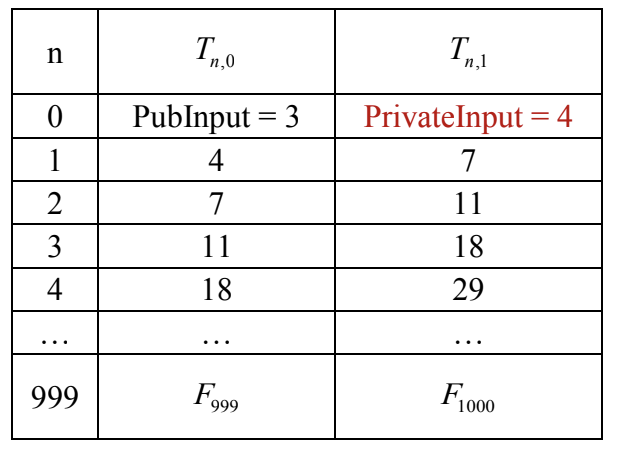

# zk_stark
本文学习zk_stark的数学原理，[参考](https://drive.google.com/file/d/1yzC7HEKxTn1Acf5Htt3SLrKM95wj6ksb/view)

[TOC]

# Merkle承诺
对于一个Merkle树每个叶子节点发生变化都会影响根哈希，所以可以通过对某个叶子计算根哈希来进行承诺：

**承诺：** 基于多项式的值生成一个Merkle树root

**打开承诺：** 基于$root(f)$计算随机点c，发送数据$(root(f), c, path(c))$。$path(c)$包含路径上所有兄弟节点的哈希用来验证根哈希。

**验证：** 根据$(c,path(c))$计算根$root'$，与接收到的root进行校验：
$$
root' = root
$$
确保c在树上。

# FRI多项式低阶检测
## 直接测试
对于一个常量函数$f(x) = c$，选取一个固定点$z_1$并计算随机点$w$，检测：
$$
f(z_1) = f(w)
$$
则接受多项式$f(x)$的阶小于1 。对于线性多项式$f(x) = bx +c$，在固定点$z_1,z_2$和计算随机点$w$上，检测三个点在同一条直线上则接受多项式$f(x)$的阶小于2 。d阶以内的多项式$f(x)$需要d个固定点和1个随机点进行检测。

## 组合测试
对于两个d阶以内的多项式$f(x), g(x)$，使用上面的测试需要使用$2d+2$个点。可以计算随机数以及：
$$
h(x) = f(x) + \alpha g(x)
$$
通过$h(x)$构造Merkle树来验证。这样就只需要d+1个点。

## 多项式折半
阶次为d的多项式可以从偶数项和奇数项分别分为两个多项式：
$$
f(x) = \sum_{i = 0}^n a_i x^i
$$
$$
g(x^2) = \sum_{i = 0}^{ \frac{n}{2} } a_{2i} x^{2i}
$$
$$
x h(x^2) = \sum_{i = 0}^{ \frac{n}{2} } a_{2i + 1} x^{2i + 1}
$$
有$f(x) = g(x^2) + x h(x^2)$。gh阶数不同时可以补充0。于是得到了两个分解的多项式$g(x),h(x)$ 阶为 $\frac{d}{2}$。生成随机数$\alpha$可以构造新的 $\frac{d}{2}$ 阶多项式：
$$
f'(x) = g(x) + \alpha h(x)
$$

## FRI原理
FRI（Fast Reed-Solomon Interactive Oracle Proof of Proximity）基于随机数生成改造成非交互式的。通过折半，可以不用$O(d)$而是$O(log(d))$次实现对d阶多项式的阶测试。

**第一步**：

**证明：** 对d阶多项式$f_1(x)$的值进行Merkle承诺，计算$root(f_1)$和随机数：
$$
z = Hash(root(f_1))
$$
计算z的函数值$f_1(z), f_1(-z)$。发送数据：$root(f_1), f_1(z), f_1(-z), path(f_1(z)), path(f_1(-z))$。

**验证：** 通过$root(f_1)$计算z，确定两个点在Merkle数上。

**第二步：** 通过z和$root(f_1)$计算随机值$\alpha_2 = Hash(z, root(f_1))$，折半公式：
$$
f_1(x) = g_1(x^2) + x h_1(x^2)
$$
$$
f_2(x) = g_1(x) + \alpha_2 h_1(x)
$$
计算随机数$-z^2$处的值，发送数据：$root(f_2), f_2(-z^2), path(f_2(z^2)), path(f_2(-z^2))$。其中$f_2(z^2)$可以通过$f_1(z), f_1(-z)$计算。

**验证：** 计算值$\alpha_2, f_2(z^2)$，确定两个值在树上。

**第i步：** 重复折叠验证

**第n=log(d)步：** 在此时$f_{log(d)}(x)$的阶已经到1，所以可以直接测试来完成常量多项式的测试。

## 概率分析
每次计算验证通过随机值来防止伪造并进行非交互，通过每次省缺一个函数值并从上一轮中的函数值计算，这样的计算可以确保函数折叠正确并减少传输值。整个折叠验证过程中在传输path的过程中传输了大量值，因此证明会很大。

在整个流程中作弊成功的可能为$f_i(z) = f_i(-z) = 0$，这样包括折半多项式和折半多项式的两个构成部分都是零。这个概率首先很小，其次因为有多轮折半所以一直能作弊成功的概率指数减少，所以证明方作弊成功的概率可以忽略。

# 斐波那契数列Stark
## 零知识证明
对于一个NP问题F，证明方有公开输入X和保密输入Y，公开输入Z。证明：
$$
F(X,Y) = Z
$$
则验证方接受该事实。

## 斐波那契数列
对于输入X，Y，计算Z为第1000个斐波那契数列值，认为这样的$F(X,Y) = Z$是NP问题。对于这个问题可以构造一个表格，例子：

对于这个迹有转换约束：
$$
T_{i+1, 0} = T_{i, 1} \quad T_{i+1, 1} = T_{i, 0} + T_{i, 1}
$$
和边界约束：
$$
T_{0,0} = X\quad T_{1000, 1} = Z
$$
## 迹多项式
通过迹中的寄存器$T_{n,0}, T_{n, 1}$的取值可以通过FFT构造处多项式表达。于是可以构造从斐波那契数列到多项式约束的等价转化：
$$
Q(x) = P_1(i+1) - (P_0(i) + P_1(i)) = 0, i = 0, \ldots 999
$$
多项式值等于零，可以构造商多项式：
$$
R(x) = \Pi_{i}^{999} (x-i)
$$
$$
C(x) = \frac{Q(x)}{R(x)}
$$
是一个常量多项式。这个商多项式是1阶的，可以通过构造更复杂的斐波那契数列来构造比迹的阶次更高的商多项式。比如三元乘法斐波那契，四元乘法斐波那契。

在得到转换约束商多项式和边界约束商多项式之后，就可以通过证明知道商多项式来证明知道约束，接着知道秘密值满足斐波那契数列要求。

## FRI原理
在构造出需要的多项式之后通过计算随机数构造多项式：
$$
C(x) = \alpha_0\times C_0(x) + \alpha_1\times C_1(x) + \alpha_2\times C_2(x)+ \alpha_3\times C_3(x)
$$
对$C(x)$进行折半验证就等价于验证了秘密。回顾一下KZG可以发现这里对待商多项式只是处理的方法不同，KZG使用基于有毒废料的CRS，FRI使用大量Hash和Merkle承诺。所以虽然不需要trust setup但是证明变得巨长。

# zkStark协议
## 算数化
zkStark算数化的两个重要方法：
* 构建程序的代数中间表达(Algebraic Intermediate Representation AIR)，用s个多项式描述当前执行状态与下一执行状态的转化约束。
* 将多项式线性组合成一个(Aogebraic Linking Interactive Oracle Proof ALI)

### AIR转换
可以表示一个AIR为一个低度多项式的集合：
$$
P = \{P_1(\vec X, \vec Y), P_2(\vec X, \vec Y), \ldots , P_s(\vec X, \vec Y)\}
$$
其中$\vec X, \vec Y$是当前与下一步计算状态。系统中变量数量为w，约束个数为s。一对解$\vec x, \vec y$成立当且仅当它们是P共同的解。

### ALI
将s个约束多项式简化为单一约束，可以使用随机数线性组合

## 执行轨迹
对于程序中每个中间状态的数据使用一个寄存器，执行轨迹就是包含每个状态数据值的数组。用斐波那契数列举例就是有两个寄存器，数组长度为执行次数。

每次状态转换都应满足一定约束，此外还有输入输出的边界约束。

## zkStark证明系统
### 多项式承诺
多项式分为两种类型：
* 整个程序的执行轨迹，对应迹多项式。
* 执行过程中需要满足的约束条件，对应商多项式。

#### 实现
之前的多项式承诺的实现包括步骤：
* 生成特定的代数结构G，以及<PK,VK>，用于承诺一个小于t阶的多项式。对于不定长的for循环需要递归零知识证明。
* 生成多项式承诺
* 对给定的随机数打开承诺

与KZG差不多，但是使用默克尔树承诺：
* **设置：** 不需要额外的可信设置，只需要确定哈希函数
* **承诺：** 求出多项式在其定义域上所有单位根的值：$\phi(\omega^0), \phi(\omega^1), \phi(\omega^2), \ldots$，以此为叶子节点计算默克尔树根作为承诺
* **打开承诺：** 验证者选择一些随机挑战点计算默克尔树是否正确。

#### 迹多项式承诺
迹多项式的值即为单位元i次方所在位置多项式值为寄存器值。因为默克尔树要求叶子节点个数必须为2的次幂所以需要补充上程序继续按约束条件执行的结果。经验上来讲可以通过控制计算数量（比如以太坊承诺中交易单数量）来保证生成的迹多项式大小接近2的次幂。

#### 低度多项式扩展（Low-Degree Extension）
出于安全性的考虑需要在比迹多项式值域更大的空间上进行承诺。比如一个本身是N阶的多项式，希望把它扩展到2N阶，只需要把原来的N次生成元变成2N次生成元并用拉格朗日插值计算多项式。于是也可以通过单位元生成其他位置的多项式值但是多项式阶数并未增加。（这里不知道FFT是否有某种性质可以降低阶次，毕竟值域增加对应的系数也会增加，如果扩展值域到$2^kN$且k很大的话拉格朗日可能计算会更快）

#### 约束多项式承诺
约束多项式的构造与商多项式类似，包含边界约束和转换约束。在验证的时候可以通过线性组合来合并成一个多项式。由于不同的多项式有不同的阶所以需要在原来的多项式上乘以一个随机多项式来补充阶次：
$$
CP(x) = \sum_{j = 0}^k c_j(x)(\alpha x^{d-d_j } - \beta_j )
$$
最后再LDE域上进行多项式进行承诺

#### DEEP-FRI
有了上述约束就可以通过线性组合来验证多项式阶，接着验证多项式成立。zkStark额外使用一个方法来保证安全性：随机选取基域中的点（自变量x的取值比LDE要大很多）。如：
$$
DEEP(x) = \alpha_0 \frac{s_0(x) - s_0(z)}{x - z} + \alpha_1 \frac{s_1(x) - s_1(z)}{x - z} + \alpha_2 \frac{CP(x) - CP(z)}{x-z}
$$
与KZG里面的辅助多项式类似，可以做到零知识也可以增加伪造难度。在实际中约束要比迹多项式阶大（比如有一个乘法约束就要多一倍）。一般会把约束多项式拆分成多个阶小于d的多项式。这样构造的DEEP一般会小于d-2阶（因为除以了x-z），在FRI时会随机乘以一个多项式使其阶数加一，验证其阶数小于d-1 。构造的顺序：
* 先进行补齐，线性组合
* 乘以爆炸引子扩展到LDE

### FRI低度多项式实现
实现中的FRI可以每次折叠不只折两份，比如要打开1000个点，把要打开的点分成$100\times 10$的矩阵，对于每一行的数据线性合并：
$$
f'(x_i) = f(x_i) + \alpha f(x_{i+1}) + \ldots + \alpha^{N-1}f(x_{N-1})
$$
$\alpha$用每行的哈希计算的merkle树根计算随机值。新得到的多项式阶会降N倍，在多次打开后可以把FRI直接验证的复杂度降到可接受范围。

### 验证者检查
#### 验证RFI
首先对于每次折叠验证，因为有上一个树的merkle承诺所以可以通过计算上一层的N个点和下一层的对应点是否通过折叠得出就可以确定折叠正确。接着对降阶后的多项式使用低阶验证。

#### 验证多项式
为了确保多项式是由约束多项式和迹多项式组合，可以在任意点验证DEEP。验证者可以由证明者提供任意点的DEEP值和各个多项式值来验证。可以多次验证来达到安全参数。

#### 磨损因子
为了防止证明者靠算力反复重试，可以在提供stark证明的时候同时提供一个PoW证明，让重试代价变大。

# BrainStark
[BrainStark](https://aszepieniec.github.io/stark-brainfuck/engine)是一个stark vm项目，可以了解stark是如何从程序到证明的（而不是简单的斐波那契数列）
## 寄存器的执行轨迹
对于一个在线性时间中运行的CPU寄存器，它包含一个指针和指针指向的值。比如：
|clk|mp|mv|
|---|---|---|
|0|0|0|
|1|0|5|
|2|1|0|
3|0|5|

整个寄存器的约束关系比较难实现。如果通过对寄存器访问的一致性来排序：

|clk|mp|mv|
|---|---|---|
|0|0|0|
|1|0|5|
3|0|5|
|2|1|0|

可以使用这样的规则来约束：
* 当`mp`改变的时候，`mv`为0（初始值）
* 当`mp`不变并且`clk`变化超过1的时候，`mv`不变

但这样会破坏由运行时间组织的运行轨迹的值，所以需要额外的承诺保证两个多项式是相同的。
### Permutation Argument
通过提取两列寄存器指向数值（这里更一般化一点）
|mv1|mv2|
|---|---|
|x|x|
|y|z|
z|y|
w|w|

并生成两列约束：
|mv1|e1|mv2|e2|
|---|---|---|---|
|x|$\alpha$-x|x|$\alpha$-x|
|y|($\alpha$-y)($\alpha$-x)|z|($\alpha$-z)($\alpha$-x)|
z|($\alpha$-x)($\alpha$-z)($\alpha$-y)|y|($\alpha$-x)($\alpha$-z)($\alpha$-y)|
w|($\alpha$-x)($\alpha$-y)($\alpha$-z)($\alpha$-w)|w|($\alpha$-x)($\alpha$-y)($\alpha$-z)($\alpha$-w)|

对于`mv1`与`e1`有约束：$e1_i = e1_{i-1}\times (\alpha - mv1_i)$，通过这个约束和对两个`e`的边界相等检测就可以证明两个表等同。上面的$\alpha$由随机数生成。

### evaluation argument
另一种比较重要的约束是一个读取表按顺序为另一个读取表的子表：

|J|c|e|
|---|---|---|
0|u|0
1|x|x
0|v|x
1|y|$\alpha$x + y
0|w|$\alpha$x + y
1|z|$\alpha^2$x + $\alpha$y + z

c|e|
|---|---|
x|x
y|$\alpha$x + y
z|$\alpha^2$x + $\alpha$y + z

其中`J`代表是否属于子表。用约束可以证明子表关系成立。

## Brainfuck
第一部分其余在讲一些具体实现，由于语言不通也不知道都对应stark哪部分术语。但感觉下来都是一些优化方面的，所以先来看看实现。

Brainfuck是一个自动机，包含八个指令并且图灵完备。具体实现可以看材料，比较简洁。Brainfuck VM包含两个寄存器，储存指令指针和内存指针。当指令指针超出指令长度的时候VM终止。VM状态改变视指令变化。

## 算术化
核心就是通过一个指令的多项式来分别约束每次读取到的不同指令：
$$
\xi_{phi}(ci) = c_i \Pi_{\phi\in\Phi\backslash\psi}(ci-\phi) \quad\text{where}\quad ci\in\Phi = \{allinstruction\}
$$
把这个多项式和每种指令的约束乘在一起就可以通过读取到的指令限制行为。
### tables
有7个base column：执行时钟，指令指针，当前指令，下个指令，数据指针，当前数据，当前数据逆（用来限制需要判断是否为零的情景）。还有四个扩展列：指令、储存的排列，输入输出的评估。

### difference constrain
由于terminal要打开给验证者进行判断，所以需要在初始时乘以一个随机数来做到零知识。所以需要一个约束来约束ipa和ppa的初始值。可以使用商多项式：
$$
\frac{f_{mpa}(X) - f_{ppa}(X)}{X-1}
$$
保证初始时相同，这个多项式也是低阶的。

### 其他
所有约束可见参考文档。与之前的纯粹算数电路的stark表不同它引入来指令、指针，通过指令调用不同的表约束。通过input/output ttable约束内存，通过instruction table约束指令，这两个类似于witness的东西，让验证者可以通过某些条件验证程序内部执行的正确性。vm也可以通过lookup table等方式扩大功能，实现一些其他的指令。
